# nano-ros Architecture Overview

nano-ros is a lightweight ROS 2 client library for embedded real-time systems. It runs on bare-metal, FreeRTOS, NuttX, ThreadX, and Zephyr — as well as Linux/POSIX — with full `no_std` support throughout the core stack.

This document presents the overall nano-ros architecture: the layered crate structure, RMW abstraction, executor model, board crates, and how everything composes at compile time.

## High-Level Layer Diagram

```
┌─────────────────────────────────────────────────────────┐
│  Application                                            │
│  ┌────────────────────────────────────────────────────┐  │
│  │  User code (Rust / C / C++)                        │  │
│  └────────────────────────────────────────────────────┘  │
├─────────────────────────────────────────────────────────┤
│  Core                                                   │
│  ┌────────────────────────────────────────────────────┐  │
│  │  nros  (facade — re-exports + feature gates)       │  │
│  │  ┌──────────┐ ┌───────────┐ ┌────────────��─────┐  │  │
│  │  │ nros-node│ │nros-params│ │    nros-core      │  │  │
│  │  │ Executor │ │ Parameter │ │ RosMessage traits  │  │  │
│  │  │ Node     │ │ Server    │ │ CdrWriter/Reader   │  │  │
│  │  └──────────┘ └───────────┘ └──────────────────┘  │  │
│  └────────────────────────────────────────────────────┘  │
├─────────────────────────────────────────────────────────┤
│  RMW (middleware abstraction)                           │
│  ┌────────────────────────────────────────────────────┐  │
│  │  nros-rmw  (Session, Publisher, Subscriber traits) │  │
│  ├────────────────┬───────────────┬───────────────────┤  │
│  │ nros-rmw-zenoh │ nros-rmw-xrce │  nros-rmw-cffi   │  │
│  │ (zenoh-pico)   │ (XRCE-DDS)    │  (C vtable)      │  │
│  └────────────────┴───────────────┴───────────────────┘  │
├─────────────────────────────────────────────────────────┤
│  Platform (hardware + OS abstraction)                   │
│  ┌────────────────────────────────────────────────────┐  │
│  │  nros-platform  (Clock, Alloc, Threading, TCP, ... │  │
│  │                   traits + ConcretePlatform alias) │  │
│  ├──────────┬──────────┬────────┬─────────┬──────────┤  │
│  │  posix   │ freertos │ zephyr │ threadx │ bare-    │  │
│  │          │          │        │         │ metal    │  │
│  └──────────┴──────────┴────────┴─────────┴──────────┘  │
└─────────────────────────────────────────────────────────┘
```

Four conceptual layers, each with a clear boundary:

- **Application** — user code in Rust, C, or C++. Depends only on `nros` (Rust) or `nros-c`/`nros-cpp` (C/C++).
- **Core** — the `nros` facade re-exports `nros-node` (executor, node, handles), `nros-params` (parameter server), and `nros-core` (message traits, CDR serialization). Middleware-agnostic — knows nothing about zenoh or XRCE.
- **RMW** — `nros-rmw` defines the `Session`/`Publisher`/`Subscriber` trait interface. Backend crates (`nros-rmw-zenoh`, `nros-rmw-xrce`, `nros-rmw-cffi`) implement these traits using specific transport protocols. Selected at compile time via Cargo feature flags.
- **Platform** — `nros-platform` defines traits for clock, memory, sleep, random, threading, and networking. Platform crates (`nros-platform-posix`, `nros-platform-freertos`, `nros-platform-zephyr`, etc.) implement these for each OS/RTOS. Board crates add hardware-specific init on top. See the [Platform API Reference](../reference/platform-api.md) for trait details and the [Platform Customization Guide](../guides/platform-customization.md) for which crates to modify.

## Crate Dependency Graph

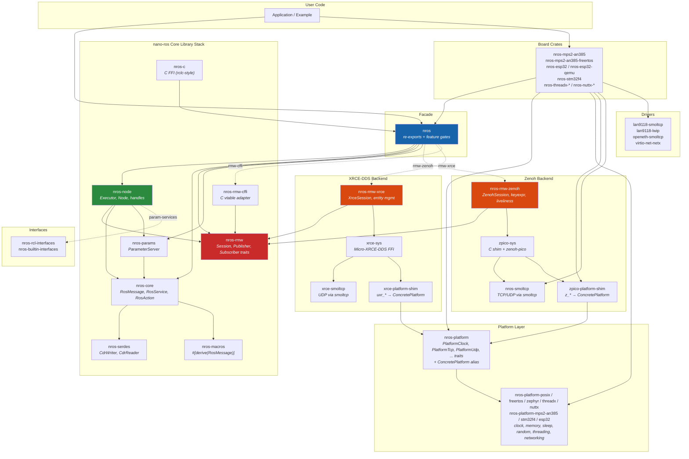

Dashed arrows indicate feature-gated optional dependencies. Solid arrows are unconditional.

## Feature Axes

nano-ros uses three orthogonal compile-time axes. Each axis is mutually exclusive, enforced by `compile_error!()` in the nano-ros facade crate. Zero features on an axis is valid (reduced functionality).

| Axis | Rule | Options |
|------|------|---------|
| **RMW Backend** | Pick one | `rmw-zenoh`, `rmw-xrce`, `rmw-cffi` |
| **Platform** | Pick one | `platform-posix`, `platform-zephyr`, `platform-bare-metal`, `platform-freertos`, `platform-nuttx`, `platform-threadx` |
| **ROS Edition** | Pick one | `ros-humble`, `ros-iron` |
| **Cross-cutting** | Any combination | `std`, `alloc`, `safety-e2e`, `param-services`, `ffi-sync` |

The first three axes are mutually exclusive within each axis. Zero features on an axis is valid (reduced functionality). Cross-cutting features are independent and can be combined freely.

A typical embedded configuration:

```toml
[dependencies]
nros = { features = ["rmw-zenoh", "platform-bare-metal", "ros-humble"] }
```

A desktop/test configuration:

```toml
[dependencies]
nros = { features = ["rmw-zenoh", "platform-posix", "ros-humble", "std"] }
```

## RMW Abstraction

The `nros-rmw` crate defines the middleware boundary as a trait hierarchy. All core logic (`nros-node`, `nros-c`) is generic over `S: Session` and knows nothing about Zenoh, XRCE-DDS, or any specific transport.

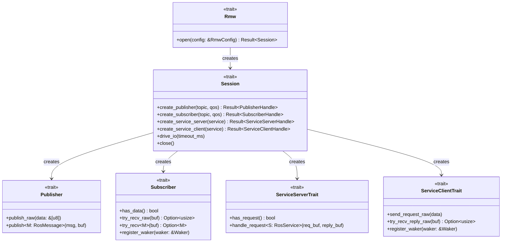

### Zenoh Backend

`nros-rmw-zenoh` implements the RMW traits on top of zenoh-pico via a C shim (`zpico.c`). Key responsibilities:

- **Key expression formatting** -- maps ROS topic/service names to Zenoh keyexprs (`<domain>/<topic>/<type>/TypeHashNotSupported`)
- **Liveliness tokens** -- ROS 2 graph discovery (compatible with `rmw_zenoh_cpp`)
- **AtomicWaker** -- event-driven async waking from zenoh-pico C callbacks
- **FFI reentrancy guard** (`ffi-sync` feature) -- wraps zpico calls in `critical_section::with()` for mixed-priority RTOS tasks

### XRCE-DDS Backend

`nros-rmw-xrce` implements the RMW traits on top of Micro-XRCE-DDS-Client. It uses an agent-based model: a lightweight client on the MCU communicates with an agent process on a gateway host that creates DDS entities.

### C FFI Backend

`nros-rmw-cffi` provides a vtable-based adapter (`nros_rmw_vtable_t`) allowing non-Rust transports to implement the `Session` trait through a C function table. Third-party RTOS vendors can plug in their own transport without writing Rust.

## Executor and Node

The executor is the runtime core. It manages callback registration, network I/O, and dispatch -- all on the stack with zero heap allocation in `no_std` mode.

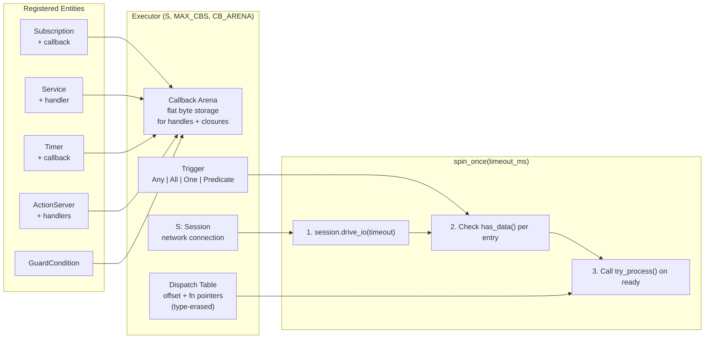

### Const-Generic Zero-Cost Opt-Out

When `MAX_CBS = 0` and `CB_ARENA = 0`, the arrays are zero-sized. This means manual-polling code (using `create_node()` + `try_recv()` without callbacks) pays zero overhead for the callback infrastructure.

### Spin Variants

The executor provides several spin strategies (`spin_once`, `spin_blocking`, `spin_period`, `spin_async`) for different deployment scenarios. See [Rust API Reference: Spin Methods](../reference/rust-api.md#spin-methods) for the full list with signatures and `no_std` compatibility.

### Node Factory

`Node<'a, S>` borrows the session from the executor and creates typed communication handles:

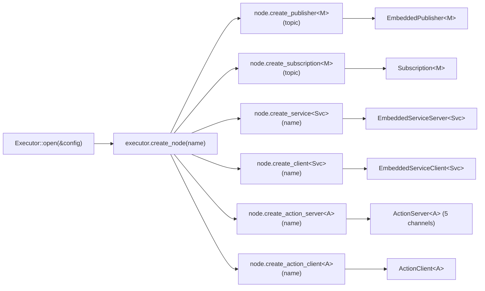

Handles can be used in two modes:

1. **Callback mode** -- register with `executor.add_subscription(sub, |msg| { ... })`, dispatched by `spin_once()`
2. **Manual-poll mode** -- call `sub.try_recv()` or `client.call()` then `Promise` directly

### Executor Semantics

Two dispatch strategies, selected at construction:

- **RclcppExecutor** (default) -- interleaved dispatch; each callback sees the latest data
- **LogicalExecutionTime (LET)** -- all subscriptions are pre-sampled at spin start before any callback runs; ensures deterministic snapshot semantics for safety-critical systems

### Async Integration

The executor integrates with external async runtimes (tokio, Embassy) without bundling one:

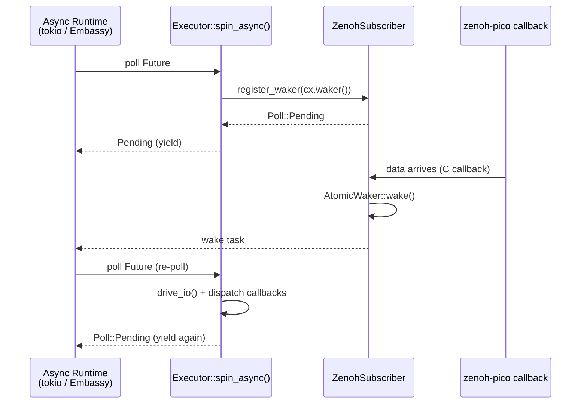

`AtomicWaker` bridges C-level zenoh-pico receive callbacks to Rust `Future` waking. No `block_on` is provided -- users bring their own async runtime.

## Board Crates

Board crates provide a turn-key entry point for a specific hardware + RTOS combination. They initialize hardware, set up the network stack, and expose a `run(config, closure)` API.

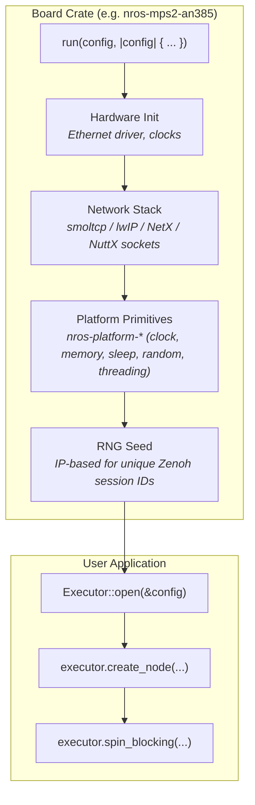

### Supported Boards

| Board Crate                 | Target         | RTOS       | Network Stack | Ethernet Driver       |
|-----------------------------|----------------|------------|---------------|-----------------------|
| `nros-mps2-an385`           | QEMU Cortex-M3 | Bare-metal | smoltcp       | lan9118-smoltcp       |
| `nros-mps2-an385-freertos`  | QEMU Cortex-M3 | FreeRTOS   | lwIP          | lan9118-lwip          |
| `nros-esp32`                | ESP32-C3       | Bare-metal | smoltcp       | WiFi (esp-hal)        |
| `nros-esp32-qemu`           | QEMU ESP32-C3  | Bare-metal | smoltcp       | openeth-smoltcp       |
| `nros-stm32f4`              | STM32F4        | Bare-metal | smoltcp       | STM32 Ethernet        |
| `nros-nuttx-qemu-arm`       | QEMU Cortex-A7 | NuttX      | NuttX sockets | virtio-net (built-in) |
| `nros-threadx-qemu-riscv64` | QEMU RISC-V    | ThreadX    | NetX Duo      | virtio-net-netx       |
| `nros-threadx-linux`        | Linux (x86_64) | ThreadX    | NetX Duo      | veth (bridge)         |

### Platform Primitives

Each platform provides OS-level primitives (clock, memory, sleep, random, threading, networking) that the transport libraries require at link time. See the [Platform API Reference](../reference/platform-api.md) for the full trait definitions and per-platform implementation details.

## C API

`nros-c` is a thin FFI wrapper over `nros-node`, following the rclc naming convention. C headers are auto-generated by cbindgen from `#[repr(C)]` types.

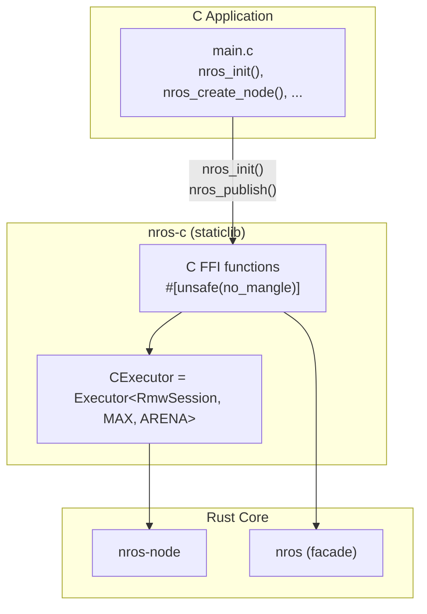

The C API resolves the generic `S: Session` parameter to the concrete backend type via the nano-ros internals module. All C structs (`nros_publisher_t`, `nros_subscription_t`, etc.) are `#[repr(C)]` with `pub` fields for cbindgen visibility.

## Message Codegen

Message types are generated from `.msg`/`.srv`/`.action` files -- never hand-written.

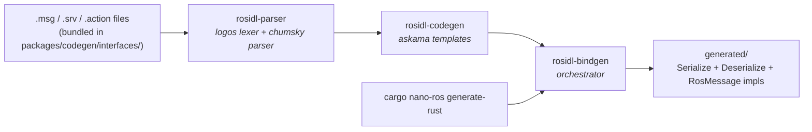

No ROS 2 installation is required -- bundled `.msg` files in `packages/codegen/interfaces/` provide all standard message definitions. Generated crate names use the `nros-` code prefix (e.g., `nros-std-msgs`).

## Data Flow: Publish

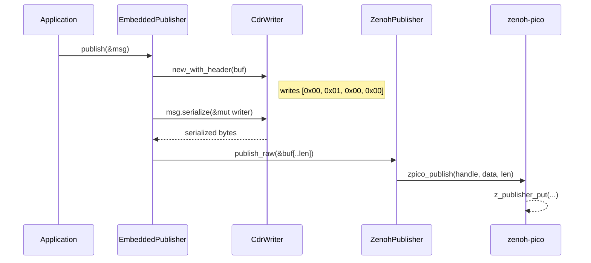

## Data Flow: Subscribe (Callback Mode)

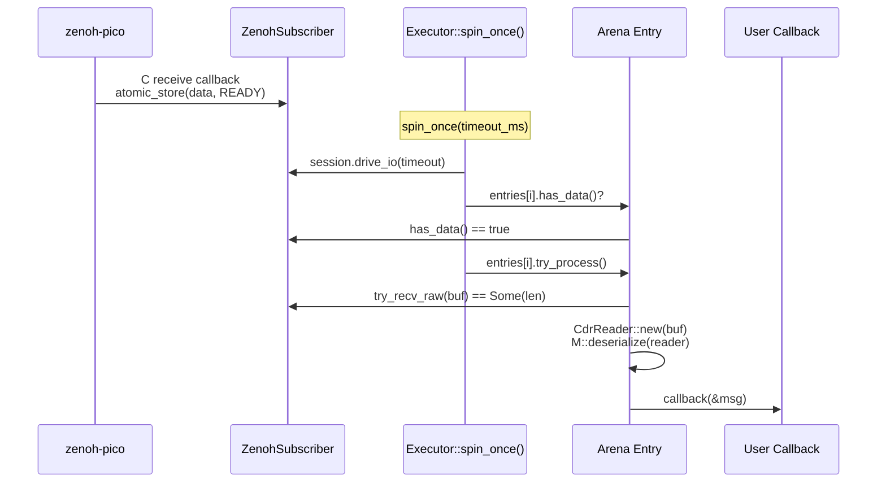

## Formal Verification

nano-ros includes two verification approaches, both running in CI:

- **Kani** -- bounded model checking (160 harnesses, ~3 min). Checks memory safety, integer overflow, and panic freedom for CDR serialization, scheduling, and protocol logic.
- **Verus** -- unbounded deductive proofs (102 proofs, ~1 sec). Proves functional correctness of algorithms, CDR roundtrips, and E2E safety properties.

Verification crates live in `packages/verification/` and are excluded from the main workspace to avoid Verus limitations with closures and function pointers in production code.

## Safety Features

| Feature              | Description                                                                                   | Compile Flag                              |
|----------------------|-----------------------------------------------------------------------------------------------|-------------------------------------------|
| E2E Safety           | CRC-32/ISO-HDLC integrity + sequence tracking (AUTOSAR E2E / EN 50159)                        | `safety-e2e`                              |
| FFI Reentrancy Guard | Wraps transport FFI calls in `critical_section::with()`                                       | `ffi-sync`                                |
| LET Semantics        | Logical Execution Time -- deterministic snapshot dispatch                                      | `ExecutorSemantics::LogicalExecutionTime` |
| Mutex Backends       | `sync-spin` (default), `sync-critical-section` (RTIC/Embassy), or `RefCell` (single-threaded) | `sync-spin` / `sync-critical-section`     |

## TSN (Time-Sensitive Networking)

nano-ros is designed to integrate with IEEE 802.1 TSN for deterministic real-time Ethernet in automotive and industrial deployments. TSN and nano-ros form complementary safety layers -- TSN provides network-level guarantees (bounded latency, jitter, fault containment), while nano-ros's E2E protocol provides application-level guarantees (data integrity, freshness).

### Safety Layer Model

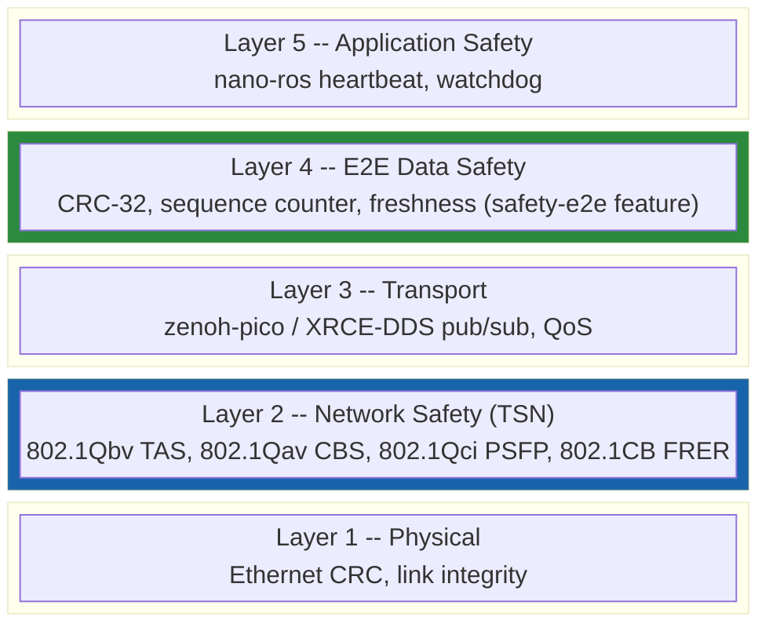

Layers 4 (E2E) and 2 (TSN) are the two safety-critical layers. Layer 4 is implemented today via the `safety-e2e` feature. Layer 2 is available through RTOS-native TSN stacks.

### TSN Standards

| Standard     | Name                                       | Guarantee                                                   |
|--------------|--------------------------------------------|-------------------------------------------------------------|
| 802.1AS-2020 | Generalized Precision Time Protocol (gPTP) | Sub-microsecond clock sync                                  |
| 802.1Qbv     | Time-Aware Shaper (TAS)                    | Hard real-time bounded latency via gate control lists       |
| 802.1Qav     | Credit-Based Shaper (CBS)                  | Statistical bounded latency (Class A: 2 ms, Class B: 50 ms) |
| 802.1Qci     | Per-Stream Filtering and Policing (PSFP)   | Ingress policing, babbling idiot protection                 |
| 802.1CB      | Frame Replication and Elimination (FRER)   | Zero-delay failover, redundant paths                        |
| 802.1Qbu     | Frame Preemption (FPE)                     | Preempt low-priority frames for express traffic             |
| 802.1DG-2025 | Automotive TSN Profile                     | OEM reference profile for in-vehicle Ethernet               |

### RTOS TSN Support

TSN capabilities are accessed through the platform's native networking stack, not through nano-ros directly. Each RTOS provides different levels of TSN support:

| RTOS     | TSN Stack             | gPTP | TAS (Qbv) | CBS (Qav) | FPE (Qbu) | Certification   |
|----------|-----------------------|------|-----------|-----------|-----------|-----------------|
| ThreadX  | NetX Duo TSN          | Yes  | Yes       | Yes       | Yes       | IEC 61508 SIL 4 |
| FreeRTOS | NXP GenAVB/TSN        | Yes  | Yes       | Yes       | No        | --              |
| Zephyr   | Native gPTP + drivers | Yes  | Partial   | Partial   | No        | --              |
| NuttX    | --                    | No   | No        | No        | No        | --              |

ThreadX + NetX Duo provides the most complete TSN support with safety certification. The NetX Duo TSN APIs (`nx_shaper_cbs_*`, `nx_shaper_tas_*`, `nx_shaper_fpe_*`) are available in `third-party/threadx/netxduo/tsn/`.

### TSN Hardware Platforms

| Platform                   | MCU           | TSN Features                     | RTOS Path                 |
|----------------------------|---------------|----------------------------------|---------------------------|
| NXP MIMXRT1180-EVK         | i.MX RT1180   | Integrated 5-port GbE TSN switch | FreeRTOS + GenAVB/TSN     |
| NXP FRDM-MCXE31B           | MCX E31       | 10/100M Ethernet + TSN           | ThreadX + NetX Duo        |
| TI AM243x LaunchPad        | Sitara AM243x | PRU-ICSSG with gPTP, TAS, CBS    | FreeRTOS (enet-tsn-stack) |
| Microchip SAM E70 Xplained | SAME70        | QAV (CBS) via GMAC               | Zephyr                    |

### Integration Architecture

TSN operates below the nano-ros transport layer. The RTOS network stack configures TSN shapers and filters on the Ethernet MAC, providing deterministic delivery guarantees to all traffic -- including zenoh-pico sessions -- without any changes to nano-ros application code.

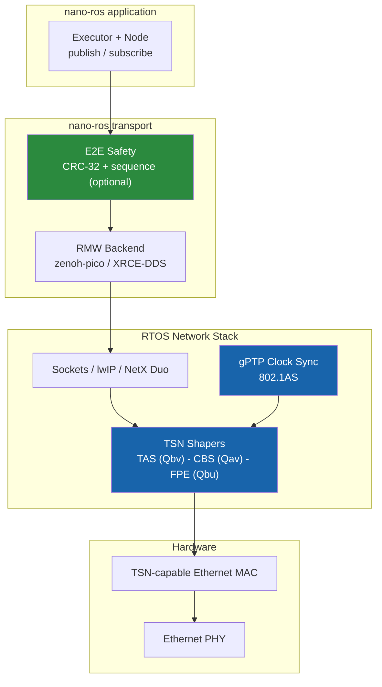

## Summary

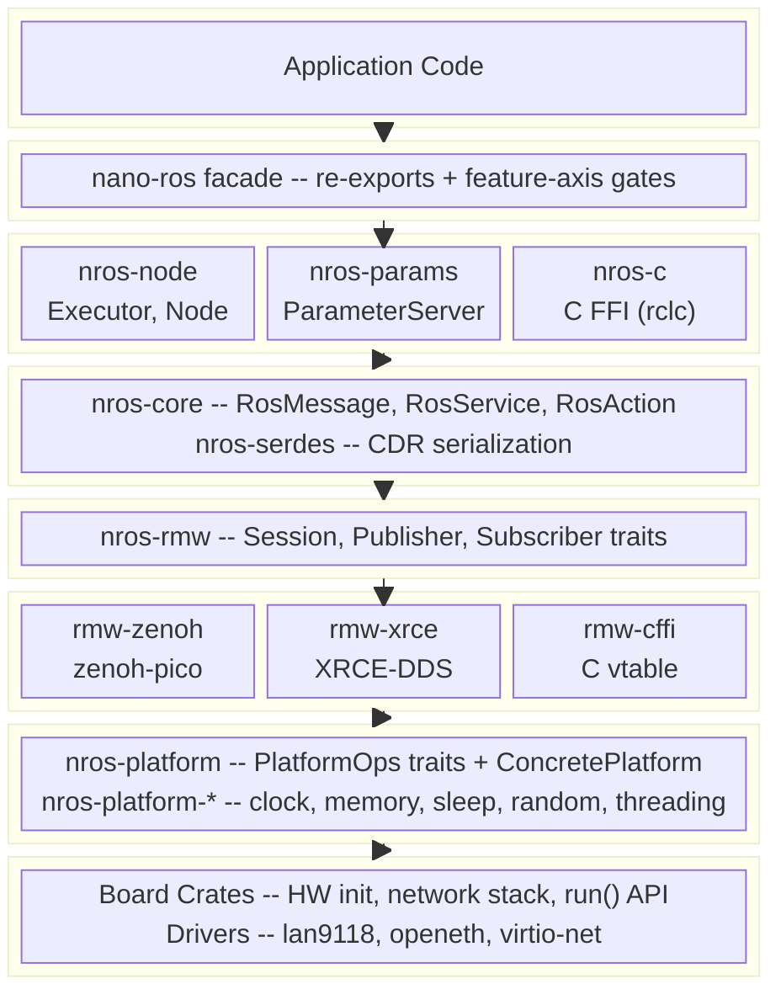
