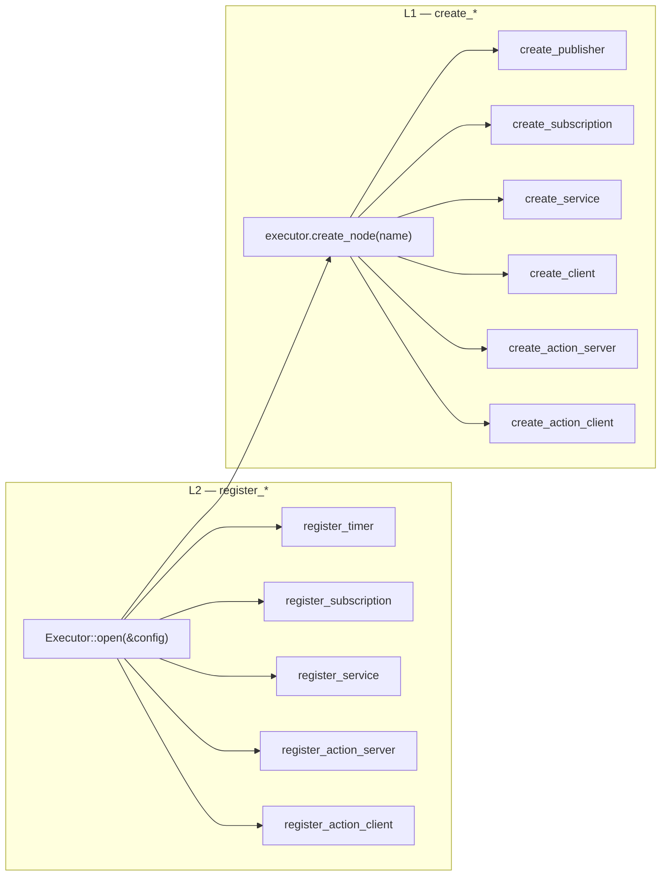

# Two-Layer API

nano-ros exposes the same communication primitives — subscriptions, publishers, services, service clients, action servers, action clients, timers — through **two layers** with disjoint verbs. Picking between them is a per-entity deployment choice. The two layers share the same session and compose freely.

| | Layer 1 — caller polls | Layer 2 — executor dispatches |
|---|---|---|
| **Verb** | `Node::create_*` | `Executor::register_*` |
| **Returns** | Owned handle | Handle ID + dispatched closure |
| **Receive shape** | `try_recv()` / `call()` → `Promise<T>` / `try_accept_goal(...)` | Closure runs on rx / reply / timer fire |
| **Scheduler** | Caller (RTIC, embassy, app loop) | `Executor::spin_once` |
| **Typical use** | RTIC tasks, single-task FreeRTOS, RT-bounded loops | Callback-shaped apps, multi-handler servers |

## Rationale

Embedded callers want both. RTIC owns scheduling and refuses to hand its loop to a library; an embassy task wants to `.await` a `Promise`; a FreeRTOS task-per-entity port wants tight `try_recv` polling. None of those fit the L2 callback model.

But a posix app that handles a dozen topics + a couple of services + an action server wants L2 — write one closure per entity and let `spin_once()` route events. Forcing it through L1 means writing a manual dispatcher.

The two layers are deliberately **separate verb sets** so the choice is explicit in source:

- `node.create_subscription::<M>("/topic")` — caller polls. No executor magic.
- `executor.register_subscription::<M, _>("/topic", |m| { ... })` — executor dispatches.

The C / C++ FFI mirrors this split: `nros_subscription_init` (L1) vs `nros_executor_register_subscription` (L2); `nros_subscription_init_polling` (L1, inline-storage) vs `register_subscription_*` (L2, executor arena).

## What goes where



Both layers are wired up by the same call to `Executor::open` — the `register_*` family attaches to the executor's arena, `create_*` borrows the executor's session through a short-lived `Node`. The handles returned by `create_*` outlive the `Node` (owned, not borrowed), so the canonical pattern is to scope the `Node` to creation time only:

```rust,ignore
let mut executor = Executor::open(&config)?;
let publisher = {
    let mut node = executor.create_node("talker")?;
    node.create_publisher::<Int32>("/chatter")?
};   // node drops here; publisher outlives it
```

## Picking the right layer

**Use L1 (`Node::create_*`) when:**
- The caller has its own scheduling primitive (RTIC dispatcher, embassy task, FreeRTOS task per entity).
- The flow is fundamentally request-response — service-client `Promise<Reply>` and action-client `send_goal` → `get_result` work this way.
- The receive logic isn't simple enough to express as a one-shot closure — e.g. a Fibonacci server that publishes feedback in a loop after accepting a goal.
- You want zero allocations and no executor arena overhead (the L2 path stores the closure + its captures inline in the arena; the arena byte budget is per-build-tunable but non-zero).

**Use L2 (`Executor::register_*`) when:**
- The flow is event-driven with a simple handler — log every received message, reply to a service synchronously, fire a 1 Hz publish.
- You want `spin_once` to dispatch all handlers from one site (less state to thread through main).
- The application is callback-shaped (matches `rclcpp` / `rclpy` mental models).

Service clients and action clients **stay on L1** in the current code — they have no typed `register_*_client<T>` API (only `register_*_raw` byte-level). The typed user path is `Node::create_client::<S>` + `client.call(&req)` → `Promise<Reply>`. The request-response + `Promise::await` model is the L1 shape.

## C / C++ mirror

Both layers cross the FFI cleanly:

- **C, L1 polling** — `nros_subscription_init_polling` writes a `RawSubscription` inline in `nros_subscription_t._opaque`. `nros_subscription_try_recv_raw` reads from the inline buffer. Same shape for service / service-client / action server / action client.
- **C, L2 callback** — `nros_subscription_init` records the C callback pointer; `nros_executor_register_subscription` allocates the executor-arena entry.
- **C++** — typed templates wrap each FFI surface: `nros::Subscription<M>` + `try_recv` for L1, `nros::PollingActionServer<A>` for the L1 action path (122.3.d.b), the L2 executor-registered callback model via the existing `nros::ActionServer<A>` API.

For the per-FFI-function spec, see the [Doxygen reference](../api/platform-cffi/index.html). For the example migration tally (32 examples on L2, 16 intentionally L1), see the [unify-api-paths roadmap doc](https://github.com/NEWSLabNTU/nano-ros/blob/main/docs/roadmap/phase-122-unify-api-paths.md).

## Event-driven path (122.3.c.6.e)

L1 polling assumes the caller has a spin loop. RTOS / embassy applications want the kernel to wake them when data lands. The `Raw*::register_waker(&Waker)` Rust API and the matching `*_set_wake_callback(state, cb, ctx)` C / C++ FFI plug a wake source into the same L1 handle. RMW backends that support waking (currently zenoh-pico for subscribers, service-clients, and service-servers) fire the callback from their rx path; other backends fall back to polling silently.

For the underlying primitive (`ServiceTrait::register_waker` in `nros-rmw`), see the trait doc. For the C wake-callback POD shape (`nros_wake_state_t { fn_ptr, ctx }`), see the [Doxygen reference](../api/platform-cffi/index.html) — same canonical-spec rule as the platform API.
