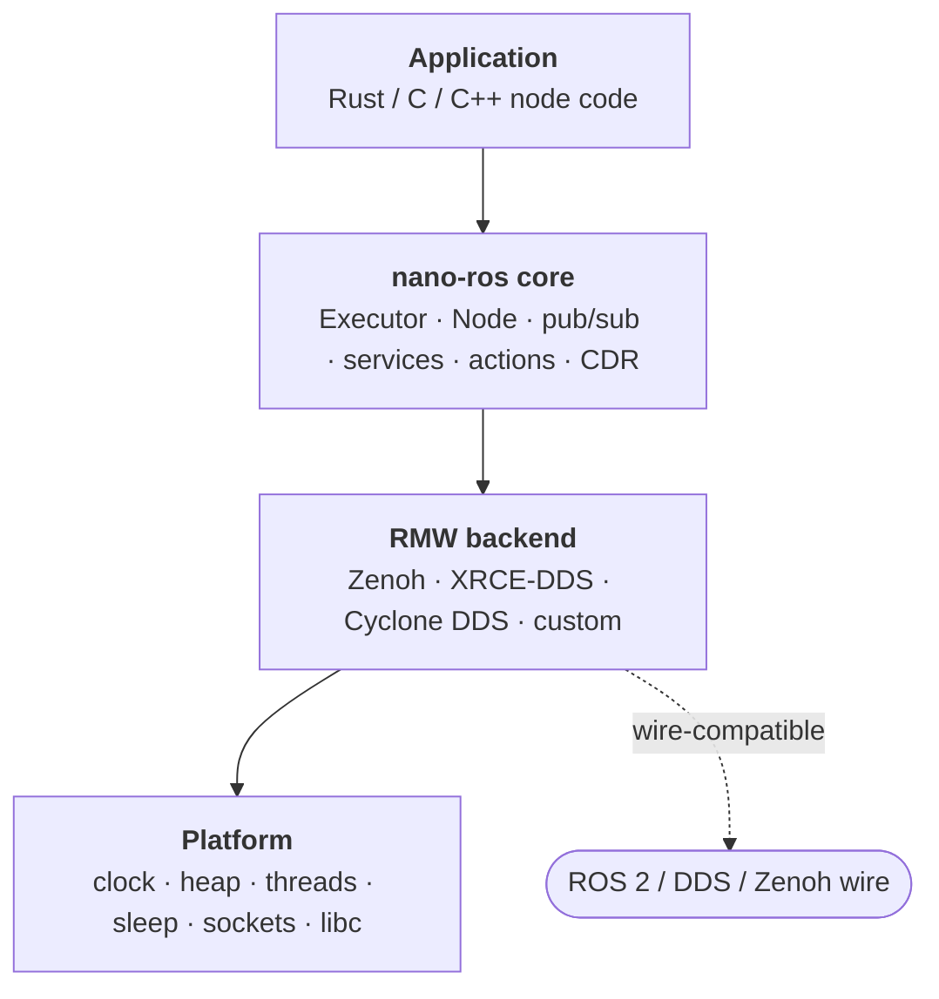

# Introduction

nano-ros is a lightweight ROS 2 client library for embedded real-time systems.
It runs on bare-metal microcontrollers, FreeRTOS, NuttX, ThreadX, and Zephyr,
as well as Linux and *BSD. The entire core stack is `no_std` compatible.



Four layers, swappable independently: the same node code runs over any RMW
backend on any platform. Here is a complete Linux publisher — register a
backend, open the executor, publish `std_msgs/String` (`Hello World: N`)
on `/chatter` once a second:

```rust
use core::fmt::Write as _;
use nros::prelude::*;
use std_msgs::msg::String as StringMsg;

fn main() {
    // Pick the backend at compile time; this one line registers it.
    nros_rmw_zenoh::register().unwrap();

    let config = ExecutorConfig::new("tcp/127.0.0.1:7447").node_name("talker");
    let mut executor: Executor = Executor::open(&config).unwrap();

    let mut node = executor.create_node("talker").unwrap();
    let publisher = node.create_publisher::<StringMsg>("/chatter").unwrap();

    let mut count = 0i32;
    executor
        .register_timer(nros::TimerDuration::from_millis(1000), move || {
            count += 1;
            let mut msg = StringMsg::default();
            let _ = write!(msg.data, "Hello World: {count}");
            publisher.publish(&msg).unwrap();
        })
        .unwrap();

    executor.spin_blocking(SpinOptions::default()).unwrap();
}
```

The same program in C and C++ is in the First Node guides:
[Rust](./getting-started/first-node-rust.md) ·
[C](./getting-started/first-node-c.md) ·
[C++](./getting-started/first-node-cpp.md).
When a project grows beyond one node, continue with
[Multi-Node Project Layout](./getting-started/workspace-from-app-node.md).

## Key Features

- **Minimal stack** — three software layers (application, nano-ros,
  transport). Lean dependency tree, fast compile times.
- **Pluggable middleware** — choose Zenoh (agent-less, direct peer
  communication), XRCE-DDS (agent-based), or Cyclone DDS (RTPS
  wire-compatible with stock ROS 2) at compile time. Same application
  code regardless of backend.
- **Rust-first with C API** — the core is written in Rust for memory safety
  and ergonomics, with a thin C FFI (Foreign Function Interface) layer
  following rclc conventions.
- **True `no_std`** — runs on bare-metal Cortex-M3 with no heap allocator.
  The `alloc` and `std` features are opt-in.
- **Standalone tooling** — `nros generate-rust` produces message
  bindings without a ROS 2 installation (bundled interface definitions).
- **Formally verified** — 160 Kani bounded model checking harnesses and 102
  Verus deductive proofs cover CDR serialization, scheduling, and protocol
  correctness.
- **ROS 2 compatible** — interoperates with standard ROS 2 nodes via
  `rmw_zenoh_cpp`, or directly over RTPS with `rmw_cyclonedds_cpp` (same
  wire protocol, no key rewriting). Topics, services, and actions work
  across the boundary.

## Quick board check — does it work on the board I have today?

| Vendor / form factor      | Chip          | RTOS / no-RTOS  | Languages | Example in repo                                   | ROS 2 interop |
|---------------------------|---------------|-----------------|-----------|---------------------------------------------------|---------------|
| ARM MPS2-AN385 (QEMU)     | Cortex-M3     | FreeRTOS / bare | Rust C C++ ¹ | `examples/qemu-arm-{freertos,baremetal}/`         | Verified      |
| ST STM32F4-Discovery      | Cortex-M4F    | FreeRTOS / bare | Rust ²    | board crate `nros-board-stm32f4`                  | Verified      |
| Espressif ESP32-C3        | RISC-V (RV32) | ESP-IDF         | Rust C C++ | `integrations/nano-ros/`                          | Verified      |
| Espressif ESP32-C3 (QEMU) | RISC-V        | bare            | Rust      | `examples/qemu-esp32-baremetal/`                  | Verified      |
| QEMU `virt` RISC-V64      | RV64GC        | ThreadX         | Rust C    | `examples/qemu-riscv64-threadx/`                  | Verified      |
| Linux host                | x86-64 / aarch64 | ThreadX sim  | Rust C    | `examples/threadx-linux/`                         | Verified      |
| QEMU Cortex-A9 / virt     | Cortex-A9     | NuttX / Zephyr  | Rust C C++ | `examples/nuttx/`, Zephyr `samples/`              | Verified      |
| Pixhawk 4 / 6X            | STM32F7 / H7  | NuttX (PX4)     | C++       | `integrations/px4/module-template/`               | Ready ⁴       |
| Generic Cortex-M0+/M4/M7  | ≥ 64 KB SRAM  | RTOS of choice  | Rust C C++ | Use your board's vendor BSP + integrations shells | Pattern shown |

**Legend:** *Verified* = booted + tested in CI. *Ready* = builds and
runs but no in-CI gate yet — drop into the matching `examples/<plat>/`
to compile and try.

Footnotes — ¹ MPS2-AN385 bare-metal is Rust-only (`nros-c` / `nros-cpp`
need an RTOS for libc / heap). ² STM32F4 Rust path is the canonical
target for the bare-metal board crate; FreeRTOS variant uses the
shared `nros-board-freertos` glue. ³ ESP32-S3 needs the `xtensa-esp32s3-none-elf`
Rust target via the [`espup`](https://github.com/esp-rs/espup) toolchain
installer (not `rustup` — Xtensa targets aren't in upstream rust). ⁴ PX4 path is via the
external-module template in `integrations/px4/` — C++ only because
PX4's uORB binding is C++-only.

## Supported platforms (by RTOS)

| Platform   | RTOS          | Network Stack  | Targets                      |
|------------|---------------|----------------|------------------------------|
| POSIX      | Linux / *BSD | OS sockets     | x86-64, aarch64              |
| Bare-metal | None          | smoltcp        | Cortex-M3, ESP32-C3, STM32F4 |
| FreeRTOS   | FreeRTOS      | lwIP           | Cortex-M3 (QEMU)             |
| NuttX      | NuttX         | BSD sockets    | Cortex-A7 (QEMU)             |
| ThreadX    | ThreadX       | NetX Duo       | RISC-V 64 (QEMU), Linux sim  |
| Zephyr     | Zephyr        | Zephyr sockets | Various boards               |

## RMW Backends

nano-ros supports several middleware backends, selected at compile
time by adding the backend crate as a dependency:

- **Zenoh** (`nros-rmw-zenoh`) — peer-to-peer via zenoh-pico. No agent
  process. Compatible with ROS 2 `rmw_zenoh_cpp`.
- **XRCE-DDS** (`nros-rmw-xrce-cffi`) — agent-based via Micro-XRCE-DDS.
  Compatible with micro-ROS agent.
- **Cyclone DDS** (`nros-rmw-cyclonedds`) — C++ shim; full RTPS wire-compat
  with stock `rmw_cyclonedds_cpp`.

Application code is identical regardless of backend — switch with a single
Cargo feature flag or Zephyr Kconfig option.

## Project Status

nano-ros is under active development. Core capabilities are functional and
exercised in CI; see the platform chapters for per-target detail.

| Capability       | Status   |
|------------------|----------|
| Pub/Sub          | Complete |
| Services         | Complete |
| Actions          | Complete |
| Parameters       | Complete |
| ROS 2 interop    | Complete |
| Zenoh backend    | Complete |
| XRCE-DDS backend | Complete |
| Cyclone DDS backend | Complete (native + embedded; some embedded action paths in progress) |
| Zephyr support   | Complete |
| QEMU bare-metal  | Complete |
| C API            | Complete |
| C++ API          | Complete |
| Message codegen  | Complete |

## How This Book Is Organized

- **Getting Started** — install toolchains, build your first app, connect
  to ROS 2.
- **Concepts** — understand the architecture, feature system, and backend
  model.
- **Guides** — step-by-step walkthroughs for message generation, QEMU
  testing, and ESP32 development.
- **Platforms** — per-RTOS setup and configuration.
- **Reference** — API details, environment variables, build commands, and
  wire protocol.
- **Advanced** — formal verification, real-time analysis, safety features,
  and contributing.
