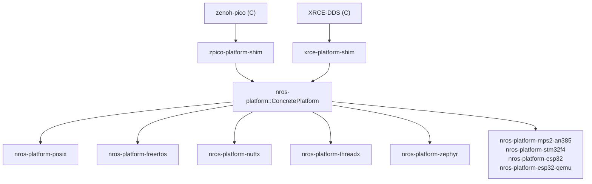

# Platform API

The platform API (`nros-platform`) is the porting boundary between nano-ros and
a concrete OS / RTOS / bare-metal target. Each platform provides a clock,
optionally a heap, optionally threading, optionally networking. Platform is
**internal** — user applications use the [Rust](rust-api.md) / [C](c-api.md) /
[C++](cpp-api.md) APIs, not the platform traits directly.

## API reference

### For C / C++ porters

| Surface | Link |
|---------|------|
| C vtable (`nros_platform_vtable_t`) | [**platform-cffi Doxygen**](../api/platform-cffi/index.html) |
| GitHub source tree | [`packages/core/nros-platform-cffi`](https://github.com/NEWSLabNTU/nano-ros/tree/main/packages/core/nros-platform-cffi) |

The C vtable header is auto-generated from the canonical platform-API
definition during the build, so the C surface always matches the runtime.

### For Rust porters

| Surface | Link |
|---------|------|
| Rust traits (`PlatformClock`, `PlatformAlloc`, `PlatformThreading`, `PlatformTcp`, `PlatformUdp`, `PlatformUdpMulticast`, `PlatformNetworkPoll`, …) | [**`nros_platform_api` rustdoc**](../api/rust/nros_platform_api/index.html) |
| GitHub source tree | [`packages/core/nros-platform-api`](https://github.com/NEWSLabNTU/nano-ros/tree/main/packages/core/nros-platform-api) |

> For the *design rationale* — why these traits are grouped this way, why we
> expose both `clock_ms` and `clock_us`, and the per-method behavior contract
> (blocking, may-fail, unsupported-fallback) — see
> [Platform API Design](../design/platform-api.md). For implementing a new
> platform, see [Custom Platform](../porting/custom-platform.md).

## Architecture

## Example platform implementations

Concrete implementations of the platform traits. Read the source — and
each crate's `README.md` — for a worked example before writing your own.
The rustdoc of a platform crate mostly replicates the trait surface; the
source tree is what's worth reading.

| Crate | Source | Target | Clock Source | Allocator | Threading | Networking |
|-------|--------|--------|--------------|-----------|-----------|------------|
| `nros-platform-posix` | [src](https://github.com/NEWSLabNTU/nano-ros/tree/main/packages/core/nros-platform-posix) | Linux/macOS | `clock_gettime` | libc `malloc` | pthreads | libc BSD sockets (Rust) |
| `nros-platform-nuttx` | [src](https://github.com/NEWSLabNTU/nano-ros/tree/main/packages/core/nros-platform-nuttx) | NuttX QEMU | POSIX (alias) | libc `malloc` | pthreads | zenoh-pico C `network.c` |
| `nros-platform-freertos` | [src](https://github.com/NEWSLabNTU/nano-ros/tree/main/packages/core/nros-platform-freertos) | FreeRTOS | `xTaskGetTickCount` | `pvPortMalloc` | FreeRTOS tasks | lwIP via freertos-lwip-sys (Rust) |
| `nros-platform-threadx` | [src](https://github.com/NEWSLabNTU/nano-ros/tree/main/packages/core/nros-platform-threadx) | ThreadX | `tx_time_get` | `tx_byte_allocate` | ThreadX threads | NetX Duo C `network.c` |
| `nros-platform-zephyr` | [src](https://github.com/NEWSLabNTU/nano-ros/tree/main/packages/core/nros-platform-zephyr) | Zephyr | `k_uptime_get` | `k_malloc` | Zephyr POSIX pthreads | Zephyr POSIX sockets (Rust) |
| `nros-platform-mps2-an385` | [src](https://github.com/NEWSLabNTU/nano-ros/tree/main/packages/platforms/nros-platform-mps2-an385) | Cortex-M3 | CMSDK Timer0 | bump allocator | single-threaded | nros-smoltcp (Rust) |
| `nros-platform-stm32f4` | [src](https://github.com/NEWSLabNTU/nano-ros/tree/main/packages/platforms/nros-platform-stm32f4) | STM32F4 | DWT cycle counter | bump allocator | single-threaded | nros-smoltcp (Rust) |
| `nros-platform-esp32` | [src](https://github.com/NEWSLabNTU/nano-ros/tree/main/packages/platforms/nros-platform-esp32) | ESP32 | `esp_timer_get_time` | bump allocator | single-threaded | nros-smoltcp (Rust) |
| `nros-platform-esp32-qemu` | [src](https://github.com/NEWSLabNTU/nano-ros/tree/main/packages/platforms/nros-platform-esp32-qemu) | ESP32-C3 QEMU | `esp_timer_get_time` | bump allocator | single-threaded | nros-smoltcp (Rust) |

The POSIX implementation is the canonical reference port — every other
platform follows the same trait-implementation pattern.

### Networking implementation status

| Platform | TCP | UDP | UDP Multicast | Socket Helpers | Source |
|----------|-----|-----|---------------|----------------|--------|
| POSIX | Rust | Rust | Rust | Rust | `nros-platform-posix/src/net.rs` via libc |
| Bare-metal (smoltcp) | Rust | Rust | Rust (smoltcp 0.12 IGMP) | Rust | Board crates via `nros-smoltcp` |
| FreeRTOS | Rust | Rust | — | Rust | `nros-platform-freertos/src/net.rs` via lwIP |
| Zephyr | Rust | Rust | Rust (NSOS-forwarded on native_sim) | Rust | `nros-platform-zephyr/src/net.rs` via Zephyr POSIX sockets |
| NuttX | C | C | C | C | zenoh-pico `unix/network.c` (POSIX-compatible) |
| ThreadX | C | C | — | C | `c/platform/threadx/network.c` via NetX Duo BSD |

`UDP Multicast` covers the `PlatformUdpMulticast` trait (RTPS SPDP, zenoh
scouting). Bare-metal smoltcp gained IGMP group join in Phase 71.26 / 97.3;
Zephyr `native_sim` gained host-kernel multicast forwarding via the NSOS
`IPPROTO_IP` patch in Phase 97.4. FreeRTOS and ThreadX have no multicast yet
— gated by lwIP's `IGMP=1` (untested) and NetX Duo's `nx_igmp_*` (untested).

## Compile-time resolution

Exactly one platform feature must be enabled. The `ConcretePlatform` type alias
resolves to the active backend — RMW shim crates use it directly. No dynamic
dispatch, no generics propagation. See the rustdoc for
[`nros_platform::resolve`](../api/rust/nros_platform/resolve/index.html) for
the full feature → type mapping.

## Writing a custom platform

- Conceptual guide: [Custom Platform](../porting/custom-platform.md) — full
  Rust + C walkthrough, trait-by-trait.
- Design rationale: [Platform API Design](../design/platform-api.md).
- C vtable porters: see the
  [platform-cffi Doxygen reference](../api/platform-cffi/index.html) for
  per-field semantics.
