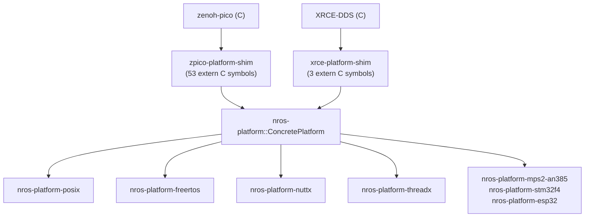

# Platform API Reference

nano-ros abstracts hardware and OS differences through the **nros-platform** trait system. Each platform (POSIX, FreeRTOS, NuttX, ThreadX, bare-metal) implements these traits once, and both RMW backends (zenoh-pico and XRCE-DDS) consume them through thin shim crates.

## Architecture



## Platform Traits (`nros-platform`)

Platform implementations provide capabilities through independent sub-traits. Not all traits are required — each RMW backend declares what it needs.

### `PlatformClock` (required by all backends)

Monotonic clock. Must be backed by a hardware timer or OS tick.

| Method | Signature | Description |
|--------|-----------|-------------|
| `clock_ms` | `fn clock_ms() -> u64` | Monotonic time in milliseconds |
| `clock_us` | `fn clock_us() -> u64` | Monotonic time in microseconds |

### `PlatformAlloc` (zenoh-pico only)

Heap memory allocation. zenoh-pico requires ~64 KB heap for transport buffers.

| Method | Signature | Description |
|--------|-----------|-------------|
| `alloc` | `fn alloc(size: usize) -> *mut c_void` | Allocate `size` bytes; null on failure |
| `realloc` | `fn realloc(ptr: *mut c_void, size: usize) -> *mut c_void` | Reallocate block |
| `dealloc` | `fn dealloc(ptr: *mut c_void)` | Free block |

### `PlatformSleep` (zenoh-pico only)

| Method | Signature | Description |
|--------|-----------|-------------|
| `sleep_us` | `fn sleep_us(us: usize)` | Sleep for microseconds |
| `sleep_ms` | `fn sleep_ms(ms: usize)` | Sleep for milliseconds |
| `sleep_s` | `fn sleep_s(s: usize)` | Sleep for seconds |

> **Bare-metal note:** Implementations should poll the network stack (smoltcp) during busy-wait sleep to avoid missing packets.

### `PlatformRandom` (zenoh-pico only)

A simple xorshift32 PRNG is sufficient. Seed with hardware entropy during platform init.

| Method | Signature | Description |
|--------|-----------|-------------|
| `random_u8` | `fn random_u8() -> u8` | Random byte |
| `random_u16` | `fn random_u16() -> u16` | Random 16-bit |
| `random_u32` | `fn random_u32() -> u32` | Random 32-bit |
| `random_u64` | `fn random_u64() -> u64` | Random 64-bit |
| `random_fill` | `fn random_fill(buf: *mut c_void, len: usize)` | Fill buffer with random bytes |

### `PlatformTime` (zenoh-pico only)

Wall-clock time for logging. On bare-metal without an RTC, return monotonic time.

| Method | Signature | Description |
|--------|-----------|-------------|
| `time_now_ms` | `fn time_now_ms() -> u64` | System time in ms |
| `time_since_epoch` | `fn time_since_epoch() -> TimeSinceEpoch` | Seconds + nanoseconds since epoch |

### `PlatformThreading` (multi-threaded platforms)

Tasks, mutexes, and condition variables. Single-threaded platforms return no-ops (0) except `task_init` which returns -1.

**Tasks:**

| Method | Signature | Description |
|--------|-----------|-------------|
| `task_init` | `fn task_init(task, attr, entry, arg) -> i8` | Spawn a new task; 0 = success |
| `task_join` | `fn task_join(task) -> i8` | Wait for task to complete |
| `task_detach` | `fn task_detach(task) -> i8` | Detach task |
| `task_cancel` | `fn task_cancel(task) -> i8` | Cancel task |
| `task_exit` | `fn task_exit()` | Exit current task |
| `task_free` | `fn task_free(task: *mut *mut TaskHandle)` | Free task resources |

**Mutexes:**

| Method | Signature | Description |
|--------|-----------|-------------|
| `mutex_init` | `fn mutex_init(m) -> i8` | Create mutex |
| `mutex_drop` | `fn mutex_drop(m) -> i8` | Destroy mutex |
| `mutex_lock` | `fn mutex_lock(m) -> i8` | Lock (blocking) |
| `mutex_try_lock` | `fn mutex_try_lock(m) -> i8` | Try lock (non-blocking) |
| `mutex_unlock` | `fn mutex_unlock(m) -> i8` | Unlock |

Recursive mutex variants (`mutex_rec_*`) have the same signatures.

**Condition Variables:**

| Method | Signature | Description |
|--------|-----------|-------------|
| `condvar_init` | `fn condvar_init(cv) -> i8` | Create condvar |
| `condvar_drop` | `fn condvar_drop(cv) -> i8` | Destroy condvar |
| `condvar_signal` | `fn condvar_signal(cv) -> i8` | Wake one waiter |
| `condvar_signal_all` | `fn condvar_signal_all(cv) -> i8` | Wake all waiters |
| `condvar_wait` | `fn condvar_wait(cv, m) -> i8` | Wait (unlocks mutex, re-locks on wake) |
| `condvar_wait_until` | `fn condvar_wait_until(cv, m, abstime) -> i8` | Wait with timeout (ms since boot) |

### `PlatformNetworkPoll` (bare-metal only)

| Method | Signature | Description |
|--------|-----------|-------------|
| `network_poll` | `fn network_poll()` | Poll smoltcp network stack for pending I/O |

Not required for platforms with OS-level networking (POSIX, Zephyr, NuttX, FreeRTOS, ThreadX).

### `PlatformLibc` (bare-metal only)

Standard C library functions needed by zenoh-pico on targets without a C runtime. Provides `strlen`, `strcmp`, `strncmp`, `strchr`, `strncpy`, `memcpy`, `memmove`, `memset`, `memcmp`, `memchr`, `strtoul`, `errno_ptr`.

## Zenoh-pico Shim Symbols (`zpico-platform-shim`)

The shim translates 53 `extern "C"` symbols expected by zenoh-pico into calls on `ConcretePlatform`. These symbols are resolved at link time.

### Clock (7 symbols)

| C Symbol | Platform Method |
|----------|----------------|
| `z_clock_now` | `PlatformClock::clock_ms` |
| `z_clock_elapsed_us` | `PlatformClock::clock_us` |
| `z_clock_elapsed_ms` | `PlatformClock::clock_ms` |
| `z_clock_elapsed_s` | `PlatformClock::clock_ms` / 1000 |
| `z_clock_advance_us` | pointer arithmetic |
| `z_clock_advance_ms` | pointer arithmetic |
| `z_clock_advance_s` | pointer arithmetic |

### Memory (3 symbols)

| C Symbol | Platform Method |
|----------|----------------|
| `z_malloc` | `PlatformAlloc::alloc` |
| `z_realloc` | `PlatformAlloc::realloc` |
| `z_free` | `PlatformAlloc::dealloc` |

### Sleep (3 symbols)

| C Symbol | Platform Method |
|----------|----------------|
| `z_sleep_us` | `PlatformSleep::sleep_us` |
| `z_sleep_ms` | `PlatformSleep::sleep_ms` |
| `z_sleep_s` | `PlatformSleep::sleep_s` |

### Random (5 symbols)

| C Symbol | Platform Method |
|----------|----------------|
| `z_random_u8` | `PlatformRandom::random_u8` |
| `z_random_u16` | `PlatformRandom::random_u16` |
| `z_random_u32` | `PlatformRandom::random_u32` |
| `z_random_u64` | `PlatformRandom::random_u64` |
| `z_random_fill` | `PlatformRandom::random_fill` |

### Time (6 symbols)

| C Symbol | Platform Method |
|----------|----------------|
| `z_time_now` | `PlatformTime::time_now_ms` |
| `z_time_now_as_str` | formatted string from `time_since_epoch` |
| `z_time_elapsed_us` | `PlatformTime::time_now_ms` delta |
| `z_time_elapsed_ms` | `PlatformTime::time_now_ms` delta |
| `z_time_elapsed_s` | `PlatformTime::time_now_ms` delta |
| `_z_get_time_since_epoch` | `PlatformTime::time_since_epoch` |

### Threading (22 symbols)

| C Symbol | Platform Method |
|----------|----------------|
| `_z_task_init` | `PlatformThreading::task_init` |
| `_z_task_join` | `PlatformThreading::task_join` |
| `_z_task_detach` | `PlatformThreading::task_detach` |
| `_z_task_cancel` | `PlatformThreading::task_cancel` |
| `_z_task_exit` | `PlatformThreading::task_exit` |
| `_z_task_free` | `PlatformThreading::task_free` |
| `_z_mutex_init` | `PlatformThreading::mutex_init` |
| `_z_mutex_drop` | `PlatformThreading::mutex_drop` |
| `_z_mutex_lock` | `PlatformThreading::mutex_lock` |
| `_z_mutex_try_lock` | `PlatformThreading::mutex_try_lock` |
| `_z_mutex_unlock` | `PlatformThreading::mutex_unlock` |
| `_z_mutex_rec_init` | `PlatformThreading::mutex_rec_init` |
| `_z_mutex_rec_drop` | `PlatformThreading::mutex_rec_drop` |
| `_z_mutex_rec_lock` | `PlatformThreading::mutex_rec_lock` |
| `_z_mutex_rec_try_lock` | `PlatformThreading::mutex_rec_try_lock` |
| `_z_mutex_rec_unlock` | `PlatformThreading::mutex_rec_unlock` |
| `_z_condvar_init` | `PlatformThreading::condvar_init` |
| `_z_condvar_drop` | `PlatformThreading::condvar_drop` |
| `_z_condvar_signal` | `PlatformThreading::condvar_signal` |
| `_z_condvar_signal_all` | `PlatformThreading::condvar_signal_all` |
| `_z_condvar_wait` | `PlatformThreading::condvar_wait` |
| `_z_condvar_wait_until` | `PlatformThreading::condvar_wait_until` |

### Socket stubs (7 symbols, bare-metal/smoltcp only)

| C Symbol | Description |
|----------|-------------|
| `_z_socket_set_non_blocking` | No-op (smoltcp handles non-blocking internally) |
| `_z_socket_accept` | Not supported on bare-metal |
| `_z_socket_close` | Close smoltcp socket |
| `_z_socket_wait_event` | Network poll + sleep |
| `smoltcp_clock_now_ms` | `PlatformClock::clock_ms` (for smoltcp driver) |

## XRCE-DDS Shim Symbols (`xrce-platform-shim`)

The XRCE-DDS shim is minimal — only 3 symbols:

| C Symbol | Platform Method |
|----------|----------------|
| `uxr_millis` | `PlatformClock::clock_ms` |
| `uxr_nanos` | `PlatformClock::clock_us` * 1000 |
| `smoltcp_clock_now_ms` | `PlatformClock::clock_ms` |

## Platform Implementations

| Crate | Target | Clock Source | Allocator | Threading |
|-------|--------|-------------|-----------|-----------|
| `nros-platform-posix` | Linux/macOS | `clock_gettime` | libc `malloc` | pthreads |
| `nros-platform-nuttx` | NuttX QEMU | POSIX (alias) | libc `malloc` | pthreads |
| `nros-platform-freertos` | FreeRTOS | `xTaskGetTickCount` | `pvPortMalloc` | FreeRTOS tasks |
| `nros-platform-threadx` | ThreadX | `tx_time_get` | `tx_byte_allocate` | ThreadX threads |
| `nros-platform-mps2-an385` | Cortex-M3 | CMSDK Timer0 | bump allocator | single-threaded |
| `nros-platform-stm32f4` | STM32F4 | DWT cycle counter | bump allocator | single-threaded |
| `nros-platform-esp32` | ESP32 | `esp_timer_get_time` | bump allocator | single-threaded |
| `nros-platform-esp32-qemu` | ESP32 QEMU | `esp_timer_get_time` | bump allocator | single-threaded |

## Compile-Time Resolution

Exactly one platform feature must be enabled. The `ConcretePlatform` type alias resolves to the active backend:

```rust
// In nros-platform/src/resolve.rs:
#[cfg(feature = "platform-posix")]
pub type ConcretePlatform = nros_platform_posix::PosixPlatform;

#[cfg(feature = "platform-freertos")]
pub type ConcretePlatform = nros_platform_freertos::FreeRtosPlatform;

#[cfg(feature = "platform-threadx")]
pub type ConcretePlatform = nros_platform_threadx::ThreadxPlatform;
// ... etc.
```

The shim crates use `ConcretePlatform` directly — no dynamic dispatch, no generics propagation:

```rust
// In zpico-platform-shim/src/shim.rs:
use nros_platform::ConcretePlatform;

#[unsafe(no_mangle)]
pub extern "C" fn z_clock_now() -> usize {
    ConcretePlatform::clock_ms() as usize
}
```
