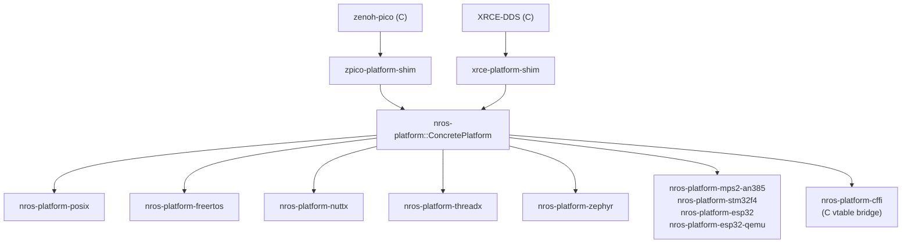

# Platform API

The platform API (`nros-platform`) is the porting boundary between
nano-ros and a concrete OS / RTOS / bare-metal target. Each platform
provides a clock, optionally a heap, optionally threading, optionally
networking. Platform is **internal** — user applications use the
[Rust](rust-api.md) / [C](c-api.md) / [C++](cpp-api.md) APIs, not the
platform traits directly.

## Canonical reference

**The platform API is documented in C.** All language bindings (Rust
traits in `nros-platform`, Rust trait crate `nros-platform-api`,
backend shims) match the C vtable signature, behaviour contracts, and
ownership rules listed in the Doxygen reference.

| Surface | Link |
|---------|------|
| **platform-cffi Doxygen** (canonical) | [HTML](../api/platform-cffi/index.html) · [header](https://github.com/NEWSLabNTU/nano-ros/blob/main/packages/core/nros-platform-cffi/include/nros/platform_vtable.h) |
| `nros-platform-api` rustdoc (Rust trait binding) | [HTML](../api/rust/nros_platform_api/index.html) |

To regenerate locally:

```bash
just doc-platform-cffi   # produces target/doxygen/platform-cffi/
```

Each function pointer's brief, parameter docs, ownership rules
(buffer-borrowed vs caller-owned), blocking / non-blocking
classification, and failure semantics live in the Doxygen output.
This page (and the design / porting docs below) **do not duplicate
the interface specification** — read the Doxygen for that.

## What this page covers

- High-level architecture: how the platform sits under the RMW shims.
- Pointers to design and porting docs.
- Quick reference to the platform implementation crates.

For per-platform behaviour differences (clock source, networking
stack, threading model, alloc policy), see
[Platform Differences](./platform-differences.md). For the design
rationale behind the trait groupings, see
[Platform API Design](../design/platform-api.md). For writing a new
platform, see [Custom Platform](../porting/custom-platform.md).

## Architecture



The Rust trait crate `nros-platform-api` and the C header
`packages/core/nros-platform-cffi/include/nros/platform_vtable.h` are
two views of the same contract. The build system generates the C
header from the canonical trait definitions; the Doxygen runs against
the generated header.

## Platform crates

Each row below is a complete worked example. The crate's `README.md`
walks the implementation; the source is the worked solution.

| Crate | Target | Source |
|-------|--------|--------|
| `nros-platform-posix` | Linux / macOS | [packages/core/nros-platform-posix](https://github.com/NEWSLabNTU/nano-ros/tree/main/packages/core/nros-platform-posix) |
| `nros-platform-nuttx` | NuttX RTOS | [packages/core/nros-platform-nuttx](https://github.com/NEWSLabNTU/nano-ros/tree/main/packages/core/nros-platform-nuttx) |
| `nros-platform-freertos` | FreeRTOS | [packages/core/nros-platform-freertos](https://github.com/NEWSLabNTU/nano-ros/tree/main/packages/core/nros-platform-freertos) |
| `nros-platform-threadx` | Azure RTOS / ThreadX | [packages/core/nros-platform-threadx](https://github.com/NEWSLabNTU/nano-ros/tree/main/packages/core/nros-platform-threadx) |
| `nros-platform-zephyr` | Zephyr RTOS | [packages/core/nros-platform-zephyr](https://github.com/NEWSLabNTU/nano-ros/tree/main/packages/core/nros-platform-zephyr) |
| `nros-platform-mps2-an385` | Cortex-M3 (QEMU) | [packages/platforms/nros-platform-mps2-an385](https://github.com/NEWSLabNTU/nano-ros/tree/main/packages/platforms/nros-platform-mps2-an385) |
| `nros-platform-stm32f4` | STM32F4 | [packages/platforms/nros-platform-stm32f4](https://github.com/NEWSLabNTU/nano-ros/tree/main/packages/platforms/nros-platform-stm32f4) |
| `nros-platform-esp32` | ESP32 | [packages/platforms/nros-platform-esp32](https://github.com/NEWSLabNTU/nano-ros/tree/main/packages/platforms/nros-platform-esp32) |
| `nros-platform-esp32-qemu` | ESP32-C3 (QEMU) | [packages/platforms/nros-platform-esp32-qemu](https://github.com/NEWSLabNTU/nano-ros/tree/main/packages/platforms/nros-platform-esp32-qemu) |
| `nros-platform-cffi` | C vtable bridge | [packages/core/nros-platform-cffi](https://github.com/NEWSLabNTU/nano-ros/tree/main/packages/core/nros-platform-cffi) |

The POSIX implementation is the canonical reference port — every other
platform follows the same trait-implementation pattern.

## Compile-time resolution

Exactly one platform feature (`platform-posix`, `platform-zephyr`,
`platform-freertos`, `platform-nuttx`, `platform-threadx`,
`platform-bare-metal`) must be enabled. `ConcretePlatform` is a type
alias that resolves to the active backend — RMW shim crates use it
directly. No dynamic dispatch, no generics propagation.

For details, see the Doxygen sections on the `NROS_PLATFORM_*`
selectors. The Rust-side feature → type mapping lives in
[`nros_platform::resolve`](../api/rust/nros_platform/resolve/index.html).
