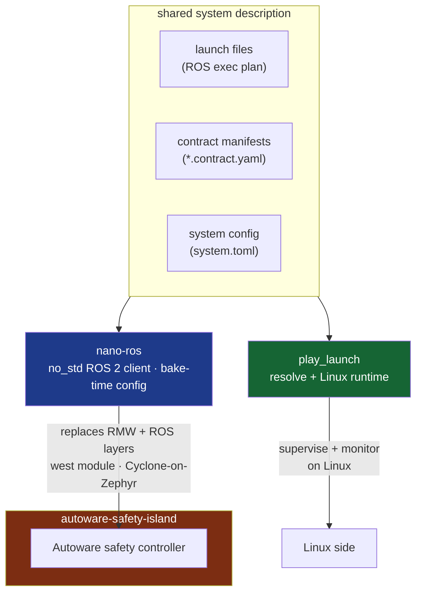
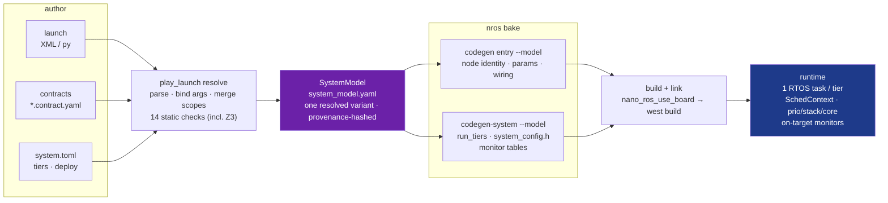

# nano-ros × Safety Island

### porting progress · one contract, two runtimes

*nano-ros · play_launch · autoware-safety-island*

<div class="abs-br m-6 text-sm opacity-60">
2026-07 · progress update
</div>

<!--
Audience already knows the idea. This deck: (1) how the three projects relate,
(2) where the ASI port stands, (3) the contract/config file split, (4) the
build pipeline that turns them into a scheduled image.
-->

---
layout: center
---

# Three projects, one system description



<div class="text-center text-sm opacity-70 mt-2">
<b>nano-ros and play_launch read the same contract + system config.</b>
ASI consumes nano-ros as its ROS/RMW layer — same graph, same rule vocabulary, both sides.
</div>

---

# Where the port stands

| Track | Status |
|---|---|
| **Contract + RT config design** | ✅ designed — SystemModel (RFC-0050) + RTOS mapper (RFC-0052); resolver + codegen landed |
| **ASI ← nano-ros re-adoption** | 🔄 in progress — 9 integration walls hit in one day, 8 fixed, 1 open (SMP-4 malloc crash) |
| **ASI controller on FVP** | ✅ boots + spins — participant, launch-seeded params, 5 subs, pubs, timers |
| **host ↔ guest DDS interop** | ✅ proven — ROS 2 Humble on host sees full topic graph over tap0; Odometry/Accel consumed, 30+ min stable |
| **AVH deployment** | 🔄 in progress — reusing ASI's existing AVH work; model-driven pilot next |
| **MR-CANHUBK3 (S32Z270) hardware** | 🚚 board in customs — build lane green already, runtime proof on arrival |

<div class="p-3 bg-blue-400/10 rounded text-sm mt-4">
First Cyclone DDS participant <b>ever</b> on the real FVP_BaseR_AEMv8R model — the walls were real
RTOS/net assumptions (socketpair, mutex pool, TCP workq stack), all fixed upstream in nano-ros.
</div>

---
layout: two-cols-header
---

# Deploying on AVH — the ASI shape

::left::

ASI consumes nano-ros as a **west Zephyr module** — ASI stays manifest authority:

```cmake
# ASI app CMakeLists.txt — before find_package(Zephyr)
include($ENV{NROS_REPO_DIR}/zephyr/cmake/nano_ros_use_board.cmake)
nano_ros_use_board(fvp-aemv8r-smp)

find_package(Zephyr REQUIRED HINTS $ENV{ZEPHYR_BASE})
find_package(nano_ros REQUIRED)

nano_ros_add_executable(controller
  BOARD  zephyr
  LAUNCH "demo_bringup:system.launch.xml"   # → MODEL system_model.yaml next
  TYPED DEPLOY zephyr)
```

Then plain `west build` — no `-b`, board comes from `use_board`.

::right::

<div class="p-3 bg-green-400/10 rounded text-sm">

**Reuse, not rebuild:**

- Same image runs on local **FVP** and on **AVH** — ASI's existing AVH bring-up carries over unchanged.
- Board is one line: `fvp-aemv8r-smp` → `mr_canhubk3` when hardware clears customs.
- RMW snippet, NIC overlay, mutex pool, TCP stacks — all pulled in by `use_board`, not hand-config.

</div>

<div class="text-xs opacity-50 mt-4">
Proven against ASI's exact consumption model in a scratch downstream west workspace.
</div>

---
layout: section
---

# Three files, three owners

launch = *what runs* · contract = *what must hold* · config = *where + how fast*

---

# The split

<div class="grid grid-cols-3 gap-3 text-xs">

<div>

**1 · Launch — ROS exec plan**
*standard ROS 2, unchanged*

```xml
<launch>
  <node pkg="ctrl_pkg" exec="ctrl"
        name="ctrl_node"/>
  <node pkg="telem_pkg" exec="telem"
        name="telem_node"/>
</launch>
```

Owner: **system author**.
Node identity is launch-authoritative
(rclcpp semantics, RFC-0046).

</div>

<div>

**2 · Contract — platform-agnostic**
*sidecar `<stem>.contract.yaml`*

```yaml
nodes:
  cropbox:
    sub:
      raw_points: { min_rate_hz: 10 }
    paths:
      main:
        input: raw_points
        output: [cropped_points]
        max_latency_ms: 5
topics:
  /sensing/lidar/pointcloud:
    rate_hz: 10
    qos: { reliability: best_effort }
paths:
  perception:
    max_latency_ms: 60
    drop: 4 / 100
```

Owner: **component dev**. QoS, rates,
latency budgets — no platform words.

</div>

<div>

**3 · System config — per-platform**
*`system.toml`, integrator-owned*

```toml
[[component]]
pkg = "ctrl_pkg"
name = "ctrl_node"
group_tiers = { ctrl = "high" }

[tiers.high]
spin_period_us = 10000
[tiers.high.posix]
priority = 80
[tiers.high.zephyr]
priority = 5    # raw Zephyr prio

[deploy.zephyr]
kind  = "embedded"
board = "fvp_baser_aemv8r/…/smp"
```

Owner: **integrator**. Tiers, priorities,
cores, deploy placement.
Tier *head* (`class`, `period_us`,
`budget_us`) stays platform-free — only
`[tiers.*.<platform>]` carries raw numbers.

</div>

</div>

---

# How they cooperate

- **Callback groups declared in code** (`create_callback_group("ctrl")`, rclcpp/rclrs shape) — group name is the join key, "like a topic name".
- **Group → tier binding lives in `system.toml`**, never in a package manifest — same structure-vs-deployment split ROS 2 already has.
- **Contract stays portable**: same `manifest.yaml` checks the pipeline on Linux (play_launch runtime) and bakes monitor tables on the MCU — identical rule ids (`rate-hierarchy-runtime`, `max-age-runtime`, `max-latency-runtime`) on `/diagnostics` from both sides.
- **One model serves all targets**: platform sub-tables (`tiers.high.zephyr`, `.posix`, `.nuttx`) coexist; consumer slices by board. Inapplicable field in the *selected* target = bake-time error.
- **Sched mappers shared across runtimes**: `rate_monotonic` / `deadline_monotonic` derive priorities inside a platform's `rt_priority_band`; explicit per-node `overrides` always beat derived values — same mapper code in play_launch (Linux RT) and nano-ros (RTOS).

```cpp
// code declares the group…
auto ctrl = create_callback_group("ctrl");
create_timer(ctrl, 10ms, &Ctrl::on_tick);
```

```toml
# …integrator binds it to a tier
group_tiers = { ctrl = "high", telem = "low" }
```

---
layout: center
---

# Build pipeline — from files to scheduled callbacks



<div class="text-center text-sm opacity-70 mt-2">
Resolve refuses to emit on any error — <b>the reviewed artifact is byte-identical to what runs</b>.
The target never parses anything; it gets the baked slice.
</div>

---

# Mapping sched contexts to the RTOS

One model field, five platform translations (RFC-0052):

| Model field | POSIX | FreeRTOS | Zephyr | ThreadX |
|---|---|---|---|---|
| `priority` | `SCHED_FIFO` | task priority | `k_thread` prio (coop ok) | thread priority |
| `stack_bytes` | attr stacksize | stack words | `K_THREAD_STACK` | stack size |
| `core` | affinity | core affinity | `k_thread_cpu_pin` | exclusion mask |
| `preempt_threshold` | ✗ reject | ✗ reject | ✗ reject | preemption change |

- `class = "real_time"` + `budget_us`/`period_us` → **Sporadic** `SchedContext`; `best_effort` → plain tier task.
- `deadline_policy` → `ignore` / `warn` / `skip` / `fault` (`nros_fault()` board hook).
- Uncontracted image → **empty monitor table → zero code** (DCE).

---
layout: center
class: text-center
---

# Takeaways

**Design done** — contract + RT config resolved into one SystemModel, both runtimes consume it.

**Port real** — ASI controller spins on FVP, host↔guest DDS interop proven, 8/9 walls down.

**Next** — AVH model-driven pilot · MR-CANHUBK3 hardware (in customs) · FreeRTOS-POSIX board variant.

<div class="text-sm opacity-60 mt-8">
RFC-0050 · RFC-0052 · phase-292 · phase-296 · play_launch phase-43
</div>
