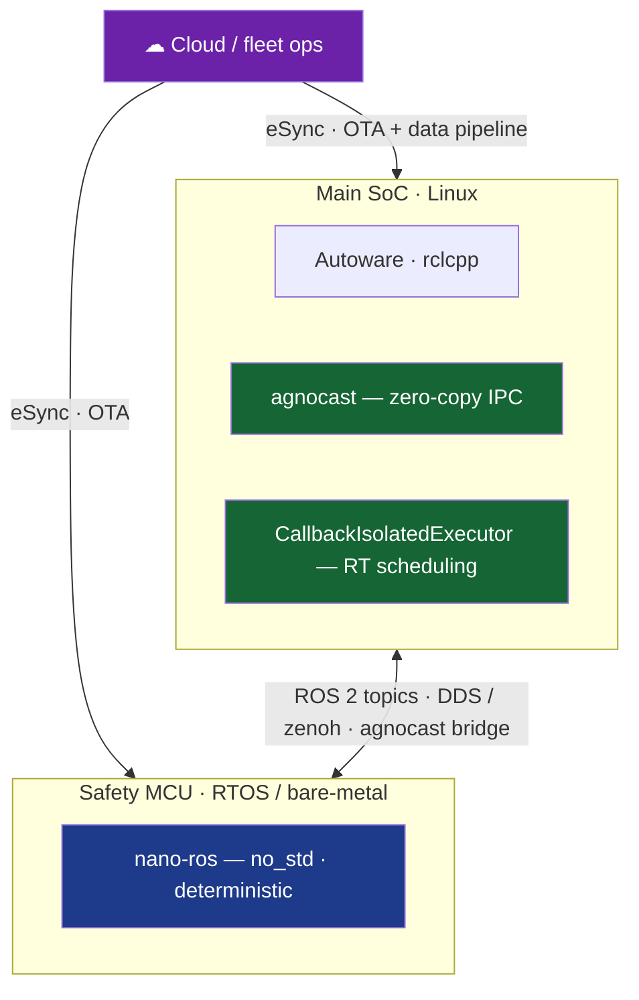

# Where nano-ros fits

### Real-time to the edge · OTA-ready

complement, not compete — *agnocast · CallbackIsolatedExecutor · eSync*

nano-ros · positioning

<!--
The honest story: these are not competitors. They live on different planes of
the same software-defined vehicle. This deck places each one, then shows how
nano-ros plugs into them.
-->

---
layout: section
---

# Why now

Autoware × eSync · Open AD Kit · mixed-criticality

---
layout: two-cols-header
---

# The vehicle got heterogeneous

::left::

- **2026** — the **eSync Alliance** and the **Autoware Foundation** form a joint **OTA working group**: a secure, bi-directional OTA + data pipeline for the AD stack.
- The **Open AD Kit blueprint** (Autoware · **SOAFEE** · eSync) deploys, updates, and manages a containerized autonomy stack **across heterogeneous compute** — inside safety-certified architectures.
- One vehicle is now **many ECUs**: a big Linux SoC **and** safety MCUs. Mixed-criticality is the default.

::right::

Two needs, everywhere on the vehicle:

- **Real-time** — predictable latency from perception to actuation.
- **Safe OTA** — ship + update + observe every ECU.

**So where does each project sit?** That is the whole question this deck answers.

Sources: esyncalliance.org · autoware.org (Open AD Kit / collaborative blueprint).

---
layout: center
---

# One vehicle, many planes

RT on the SoC (agnocast + CIE) · RT on the MCU (nano-ros) · deploy across both (eSync). <b>They compose — same ROS 2 graph.</b>

---

# Four ways to real-time

| Project | Layer | Path to real-time | Runs on | Stays in |
|---|---|---|---|---|
| **agnocast** | IPC / data | true **zero-copy** shmem — no serialize/copy; big msgs | Linux SoC, intra-host | rclcpp + any DDS |
| **CIE** | executor | **1 callback ↔ 1 OS thread**; priority + core affinity; no nested sched | Linux SoC | rclcpp |
| **nano-ros** | full runtime | **compile-time tiers / `SchedContext`** (seL4-MCS); `no_std` | safety MCU, Cortex-M/R | own RMW, ROS topics |
| **eSync** | deploy / OTA | *not RT* — secure OTA + data pipeline; **enables** mixed-crit orchestration | cloud ↔ all ECUs | OTA standard |

Different bottlenecks: <b>copy latency</b> (agnocast) · <b>executor jitter</b> (CIE) · <b>MCU determinism</b> (nano-ros). Reported: agnocast ≈16% avg / 25% worst-case (PointCloud); CIE ≈5× worst-case.

<b>eSync is orthogonal</b> — it does not schedule anything. It is the plane that <b>delivers and updates</b> the other three onto the vehicle.

agnocast: arXiv 2506.16882 · CIE: arXiv 2505.06546 (RTAS 2025) · github.com/autowarefoundation.

---
layout: two-cols-header
---

# The gap nano-ros fills

::left::

Where the SoC tools stop

The safety MCU — **Cortex-M / R**, KB of RAM, no MMU, hard-deterministic, ISO 26262 tier.

- rclcpp + DDS assume Linux, heap, threads, an OS scheduler — **they do not fit here.**
- agnocast is **intra-host shared memory** on the SoC; CIE is a **Linux executor**. Neither crosses to the MCU.
- Yet the brake / steer / safety-monitor logic **lives on that MCU**.

::right::

What nano-ros is

- **`no_std`, stack-only** ROS 2 client for embedded RTOS + bare-metal.
- **Compile-time deterministic scheduling** — priority tiers / `SchedContext` (seL4-MCS inspired).
- **Same ROS 2 topics** over zenoh / XRCE / Cyclone — peer of the SoC graph.
- **Kani + Verus** proofs in-tree.

agnocast + CIE make the <b>SoC</b> real-time. nano-ros extends the <b>same ROS graph onto the MCU</b> they can't reach.

---

# Integration paths

<h3 class="text-green-400">↔ agnocast</h3>
nano-ros is an <b>off-SoC node</b> — speaks DDS / zenoh on the wire. The <b>agnocast Bridge</b> already forwards SoC shared-memory ↔ DDS, so it reaches nano-ros.  
<b>Zero-copy on the SoC, wire to the MCU.</b>

Status: <b>exists</b> — DDS/zenoh wire + agnocast's own bridge.

<h3 class="text-green-400">↔ CIE</h3>
Complementary determinism: <b>CIE</b> schedules callbacks on Linux; <b>nano-ros</b> schedules tiers on the MCU.  
Bridge the topics → <b>mixed-criticality end to end</b>, one ROS graph, RT on both sides.

Status: <b>exists</b> — via standard ROS 2 topics.

<h3 class="text-amber-400">↔ eSync</h3>
nano-ros as an <b>OTA endpoint</b> on the safety ECU. Reproducible bake (<code>nros-sdk-index</code> pin + capability lowering) → <b>deterministic, signed, updatable</b> images; data pipeline back to the fleet.

Status: <b>roadmap</b> — fits the OTA WG / Open AD Kit.

The connective tissue is already there: <b>the ROS 2 topic graph</b>. nano-ros joins it from the MCU; eSync ships it everywhere.

---
layout: center
class: text-center
---

# nano-ros completes the picture

- **agnocast** (zero-copy) · **CIE** (executor) · **nano-ros** (MCU runtime) · **eSync** (OTA) — one mixed-criticality, updatable ROS 2 stack.
- **RT to the edge** — nano-ros brings deterministic ROS 2 to the safety MCU where Linux, DDS, and the SoC tools can't go.
- **OTA-ready** — reproducible, pinned, capability-lowered builds → a natural eSync endpoint.
- **Complementary by design** — same ROS topics, different planes. Not a competitor to anyone on this slide.

Let's build the edge tier together.

Autoware Foundation · eSync OTA working group · Open AD Kit · SOAFEE &nbsp;·&nbsp; agnocast arXiv 2506.16882 · CIE arXiv 2505.06546

