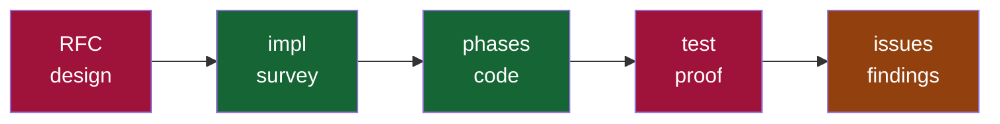
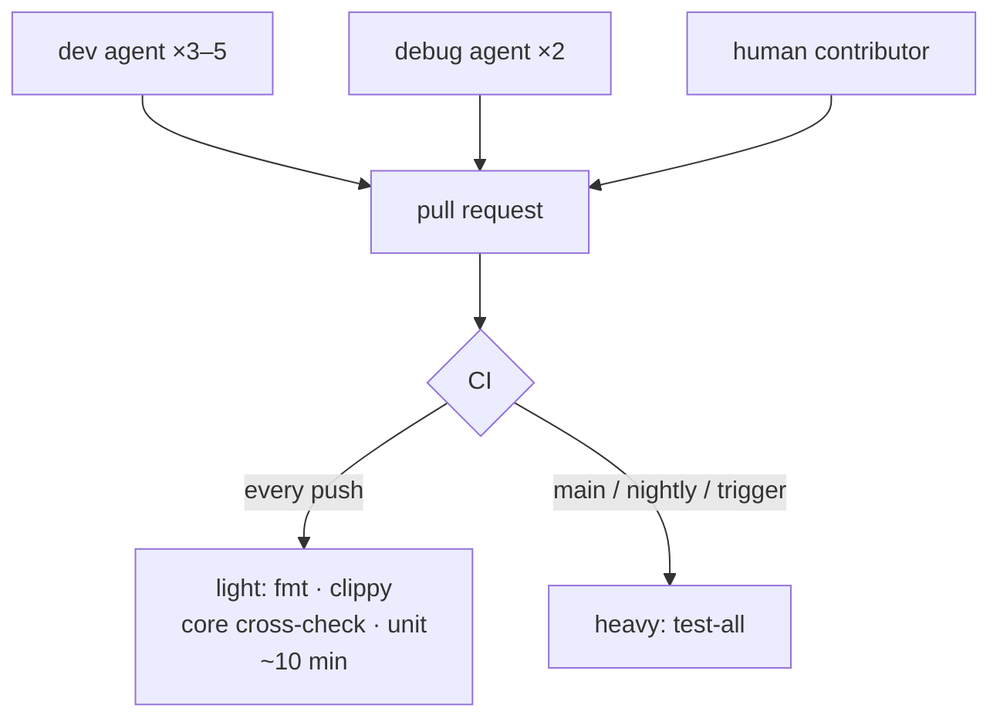
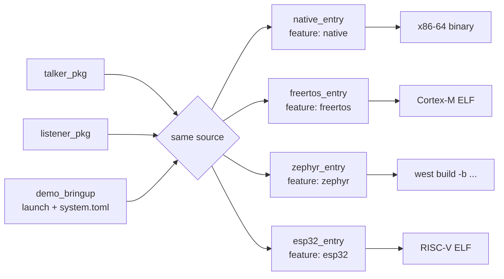
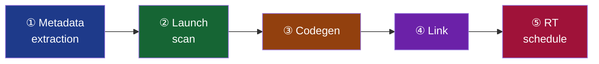
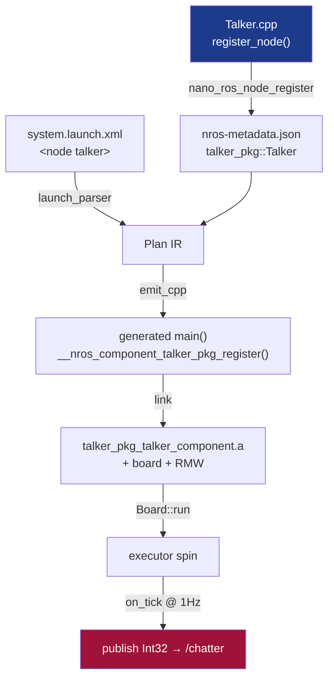

# Inside the nano-ros workspace

### From source to scheduled callback

What you *write* → what the *machine does*

<div class="abs-br m-6 text-sm opacity-60">
nano-ros · ~45 min
</div>

<!--
Two acts. Act 1: what you write — packages, bringup, entry. Act 2: the
machine — metadata, launch scan, codegen, link, schedule. Spine of Act 2
is the pipeline.
-->

---
layout: two-cols-header
---

# What is nano-ros

::left::

**A `no_std` ROS 2 client for embedded RTOS.**

- Runs on **6 targets**: bare-metal, FreeRTOS, NuttX, ThreadX, Zephyr, POSIX
- Talks the same topics as a Linux Autoware / autopilot — over real DDS/zenoh
- Core stack is `no_std`, stack-only by default
- Kani + Verus proofs in-tree

::right::

**vs micro-ROS**

| | micro-ROS | nano-ros |
|---|---|---|
| Lang | C | **Rust** + thin C/C++ |
| RMW | XRCE only | **zenoh / XRCE / Cyclone** |
| Discovery | agent | **peer-to-peer** (zenoh) |
| Verify | review | **Kani + Verus** |

<!--
The safety-MCU tier — Cortex-M/R, deterministic — is the insertion point.
rclcpp+DDS doesn't fit there. nano-ros does.
-->

---
layout: center
---

# Every build = one point in a 3-axis space

<div class="text-2xl my-8">

`RMW`  ×  `Platform`  ×  `ROS edition`

</div>

```text
rmw-{zenoh, xrce, cyclonedds}
platform-{posix, zephyr, bare-metal, freertos, nuttx, threadx}
ros-{humble, iron}
```

Compile-time **mutually exclusive** within an axis, never cross-implied.

RMW is *declared* in `system.toml` / a flag — *lowered* by the toolchain to a
cargo feature or `-DNANO_ROS_RMW`. Scope = per-deploy-binary. <span class="opacity-50 text-sm">(RFC-0001, RFC-0031)</span>

---
layout: section
---

# Act 1 — Migrate: normal ROS 2 → nano-ros

your node · your topics · your launch — kept

---
layout: center
---

# Migration in 5 steps

<div class="grid grid-cols-2 gap-8 mt-4">

<div>

1. **Drop in your `.msg` + `package.xml`** — build *unmodified* <span class="opacity-50 text-sm">(RFC-0023)</span>
2. **`rclcpp::Node` subclass → `register_node()`** — declare, don't drive
3. **Map the API** — `create_publisher/subscription/timer` → nros equivalents
4. **`RCLCPP_COMPONENTS_REGISTER_NODE` → `NROS_NODE_REGISTER`**
5. **Build files** — `ament_cmake` → `nano_ros_node_register()` + an entry pkg

</div>

<div>

<div class="p-3 bg-green-400/10 rounded mb-3 text-sm">
<b>Survives unchanged</b><br>
message defs · <code>package.xml</code> msg pkgs · launch XML · topic names · QoS intent
</div>

<div class="p-3 bg-amber-400/10 rounded text-sm">
<b>Changes</b><br>
client API (rclcpp → nros-cpp) · node lifecycle (subclass → register) · build (ament → entry pkg)
</div>

</div>

</div>

<div class="text-sm opacity-60 text-center mt-6">Proof: Autoware Safety Island runs the real trajectory follower (MPC + PID) on Zephyr/FVP via exactly this path.</div>

---

# The API map — rclcpp ↔ nros-cpp

| rclcpp | nros-cpp (declarative node pkg) |
|---|---|
| `class N : public rclcpp::Node` | `static Result N::register_node(NodeContext&)` |
| `Node(name, opts)` | `ctx.create_node(node, NodeOptions::make(name))` |
| `create_publisher<T>(topic, qos)` | `node.create_publisher<T>(e, topic)` |
| `create_subscription<T>(topic, qos, cb)` | `node.create_subscription<T>(e, topic, cb)` |
| `create_timer(this, clk, period, cb)` | `node.create_timer(e, "ms", cb)` |
| `declare_parameter<T>(k, def)` | params / per-deploy `config.toml` |
| `RCLCPP_COMPONENTS_REGISTER_NODE(C)` | `NROS_NODE_REGISTER(C, "C")` |
| `rclcpp::init / spin / shutdown` | entry pkg (`nros::main!` / `NROS_MAIN_C`) |

<div class="text-sm opacity-60 mt-3">Same nouns — node, publisher, subscription, timer. nano-ros <b>declares</b> the graph at register time; the entry pkg owns init + spin.</div>

---

# Before — real Autoware (rclcpp)

<div class="text-sm opacity-70 mb-2"><code>autoware_hazard_lights_selector/src/node.cpp</code></div>

```cpp {all|1-2|4|6-12|14-15|17-18|22}
HazardLightsSelector::HazardLightsSelector(const rclcpp::NodeOptions & options)
: Node("hazard_lights_selector", options) {
  using std::placeholders::_1;
  params_.update_rate = declare_parameter("update_rate", 10);

  sub_planning_ = create_subscription<HazardLightsCommand>(
    "input/planning/hazard_lights_command", 1,
    std::bind(&HazardLightsSelector::on_planning, this, _1));
  sub_system_ = create_subscription<HazardLightsCommand>(
    "input/system/hazard_lights_command", 1,
    std::bind(&HazardLightsSelector::on_system, this, _1));

  pub_ = create_publisher<HazardLightsCommand>(
    "output/hazard_lights_command", 1);

  timer_ = rclcpp::create_timer(this, get_clock(),
    std::chrono::milliseconds(1000 / params_.update_rate),
    std::bind(&HazardLightsSelector::on_timer, this));
}

// node.cpp footer:
RCLCPP_COMPONENTS_REGISTER_NODE(autoware::hazard_lights_selector::HazardLightsSelector)
```

---

# After — nano-ros node pkg

<div class="text-sm opacity-70 mb-2"><code>hazard_lights_selector/src/HazardLightsSelector.cpp</code> — declarative</div>

```cpp {all|1|3-4|6-7|9-12|14-17|19-21|24-25}
::nros::Result HazardLightsSelector::register_node(::nros::NodeContext& ctx) {
  ::nros::DeclaredNode node;
  auto r = ctx.create_node(node, ::nros::NodeOptions::make("hazard_lights_selector"));
  if (!r.ok()) return r;

  ::nros::DeclaredEntity pub;
  node.create_publisher<HazardLightsCommand>(pub, "output/hazard_lights_command");

  ::nros::DeclaredCallback on_timer;
  node.declare_callback(on_timer, "on_timer");
  ::nros::DeclaredEntity timer;
  node.create_timer(timer, "100", on_timer);              // 10 Hz

  ::nros::DeclaredEntity sub_plan, sub_sys;
  node.create_subscription<HazardLightsCommand>(sub_plan, "input/planning/hazard_lights_command", on_timer);
  node.create_subscription<HazardLightsCommand>(sub_sys,  "input/system/hazard_lights_command",  on_timer);
  ctx.record_callback_effect(on_timer, ::nros::CallbackEffectKind::Reads, sub_plan);
  ctx.record_callback_effect(on_timer, ::nros::CallbackEffectKind::Reads, sub_sys);

  return ctx.record_callback_effect(on_timer, ::nros::CallbackEffectKind::Publishes, pub);
}

NROS_NODE_REGISTER(autoware_hazard_lights_selector::HazardLightsSelector,
                   "autoware_hazard_lights_selector::HazardLightsSelector");
```

<div class="text-sm opacity-60 mt-1">Same topics, same msg type, same 10 Hz. No <code>main</code>, no <code>spin</code>, no <code>std::bind</code> — the entry pkg + executor own lifecycle.</div>

---

# Build + config — `ament_cmake` → nano-ros

<div class="grid grid-cols-2 gap-4 text-sm">

<div>
<div class="opacity-70 mb-1">Before — <code>CMakeLists.txt</code> (ament)</div>

```cmake
find_package(autoware_cmake REQUIRED)
autoware_package()
ament_auto_add_library(${PROJECT_NAME}
  SHARED src/node.cpp)
rclcpp_components_register_node(${PROJECT_NAME}
  PLUGIN ".....::HazardLightsSelector"
  EXECUTABLE ${PROJECT_NAME}_node)
ament_auto_package(INSTALL_TO_SHARE launch config)
```

</div>

<div>
<div class="opacity-70 mb-1">After — <code>CMakeLists.txt</code> (nano-ros node pkg)</div>

```cmake
project(autoware_hazard_lights_selector
        LANGUAGES C CXX)
nano_ros_workspace_pkg_guard()
nros_find_interfaces(LANGUAGE CPP)
nano_ros_node_register(
  NAME    hazard_lights_selector
  CLASS   autoware_hazard_lights_selector::HazardLightsSelector
  SOURCES src/HazardLightsSelector.cpp
  DEPLOY  native zephyr)        # deploy targets
target_link_libraries(
  autoware_hazard_lights_selector_hazard_lights_selector_component
  PUBLIC autoware_vehicle_msgs__nano_ros_cpp)
```

</div>

</div>

<div class="grid grid-cols-2 gap-4 text-xs mt-2">
<div class="p-2 bg-gray-400/10 rounded"><code>package.xml</code>: <code>&lt;build_type&gt;ament_cmake&lt;/build_type&gt;</code> → <code>cmake</code>; drop <code>rclcpp</code>/<code>rclcpp_components</code> deps, keep msg deps.</div>
<div class="p-2 bg-amber-400/10 rounded"><b>L.4 rule</b>: class namespace must equal the pkg name → <code>autoware::hazard_lights_selector</code> becomes <code>autoware_hazard_lights_selector::</code>.</div>
</div>

---

# RTOS reality — what the embedded target demands

<div class="grid grid-cols-3 gap-4 mt-4 text-sm">

<div class="p-4 border-2 border-blue-400/40 rounded-lg">
<h3 class="text-blue-400">Freestanding C++</h3>
Embedded builds: <code>-fno-exceptions -fno-rtti</code>.<br><br>
No throw, no <code>dynamic_cast</code>, no unwind. Errors are returned: <code>nros::Result</code>, not exceptions.<br><br>
Core is <code>no_std</code>. Avoid <code>std::string</code>/<code>std::vector</code> in hot paths.
</div>

<div class="p-4 border-2 border-green-400/40 rounded-lg">
<h3 class="text-green-400">malloc / heap</h3>
RTOS heap ≠ libc heap.<br><br>
Messages are <b>bounded</b> — seq/string caps via <code>nros-codegen.toml</code>. Stack/arena by default; executor dispatch is zero-heap.<br><br>
Cyclone transient samples: <code>ddsrt_malloc</code>, never libc.
</div>

<div class="p-4 border-2 border-amber-400/40 rounded-lg">
<h3 class="text-amber-400">Threading</h3>
No <code>std::thread</code>. Executor maps callbacks onto the board's threads.<br><br>
<code>std::mutex</code> → platform mutex (Zephyr POSIX: <code>CONFIG_MAX_PTHREAD_MUTEX_COUNT ≥ 8</code>).<br><br>
Priorities + budget via <code>SchedContext</code>.
</div>

</div>

<div class="text-sm opacity-60 text-center mt-4">The controller <b>math</b> ports as-is. The <b>runtime assumptions</b> — alloc, exceptions, threads — are what you migrate.</div>

---
layout: section
---

# Act 2 — How we build (come contribute)

agents + humans · RFC / phase / issue · CI · versions

---
layout: two-cols-header
---

# Agent-driven, human-welcome

::left::

**The project runs heavily on agents.** Humans equally welcome — the docs contract keeps both sane.

The contract — every durable thing gets filed:

- **Design decision** → an **RFC** (`docs/design/`)
- **Planned work** → a **phase doc** (`docs/roadmap/`)
- **Known bug / limitation** → an **issue** (`docs/issues/`)

::right::

<div class="p-4 bg-blue-400/10 rounded text-sm">

> When you learn something durable, file it in the right series — never grow `CLAUDE.md` with design detail.

> Design rationale goes in an **RFC**, never only in a phase doc.

> **Drift rule:** flipping an RFC to `Stable` updates `ARCHITECTURE.md` in the same commit.

</div>

<div class="text-sm opacity-60 mt-3">Agents write the design down before the code. Reviewable, linkable, durable.</div>

---

# The pipeline — many agents, clear lanes



<div class="grid grid-cols-3 gap-4 mt-4 text-sm">
<div class="p-3 rounded" style="background:#9f123922"><b style="color:#fb7185">Humans</b> — RFC design · testing · contract/merge. <i>What is correct.</i></div>
<div class="p-3 rounded" style="background:#16653422"><b style="color:#4ade80">Agents</b> (fan out) — survey · write code. <i>Already better than human here.</i></div>
<div class="p-3 rounded" style="background:#92400e22"><b style="color:#fbbf24">Both</b> — agents file issues, humans triage.</div>
</div>

<div class="mt-4 text-sm">

Many agents per stage — one per subsystem (survey), one per work item (phases, isolated worktrees). Each returns **a conclusion + its proof**, not a narrative. **Tests are mechanical scripts** — a green script *is* "done".

</div>

<div class="text-sm opacity-60 mt-2">Drop-in for your fork: <code>docs/development/AGENTS.template.md</code> — point your AI at it.</div>

---

# Copy this — `AGENTS.md` skeleton

<div class="text-xs">

```markdown
# AGENTS.md — contributor agent guide      (agents propose, humans dispose)

## Labor split
- Humans:  RFC design · testing · contract/merge        # what is "correct"
- Agents:  impl survey · write code     # fan out: 1 per subsystem, 1 per work-item

## Pipeline:  RFC → (survey) → phases → (test) → issues
1. RFC     docs/design/NNNN-slug.md      Draft→Stable→Superseded   # rationale lives here
2. Survey  agents map touch-points   →   a phase doc work breakdown
3. Phases  docs/roadmap/phase-NNN-*.md   numbered [ ] items, each with a proof
4. Test    a mechanical script per item  # a green script IS "done"
5. Issues  docs/issues/NNNN-slug.md      open→resolved · cross-link rfc/phase

## Hard rule — tests are mechanical scripts
- assert / bail / skip on unmet precondition; never eprintln+return (= silent PASS)
- no compile inside a test  →  build a fixture in the build stage, assert the artifact
- name a test by behavior, not by phase number

## Commands            # nano-ros: just check / test / test-all / ci
{{CHECK}}  {{TEST_FAST}}  {{TEST_ALL}}  {{CI}}
# CI: light checks every push · heavy {{TEST_ALL}} only on main / nightly / trigger
```

</div>

<div class="text-xs opacity-60 mt-1">Full version (frontmatter skeletons + PR checklist): <code>docs/development/AGENTS.template.md</code>.</div>

---

# Three doc series — pick the right one

| Series | Lives in | Lifecycle | Holds |
|---|---|---|---|
| **RFC** | `docs/design/NNNN-slug.md` | `Draft → Stable → Superseded` | a design decision (living doc) |
| **Phase** | `docs/roadmap/phase-NNN-*.md` | `active → archived/` | work items + acceptance; names its RFC |
| **Issue** | `docs/issues/NNNN-slug.md` | `open → resolved / wontfix` | bug · limitation · tech-debt |

<div class="mt-4 text-sm">

**How a decision moves:** Draft RFC (option space + open Qs) → discussion resolves the Qs → a **phase doc** carries work items + `Implements: RFC-NNNN` → code lands → RFC flips **Stable** + ARCHITECTURE.md updated, same commit.

</div>

<div class="text-sm opacity-60 mt-2">Whole-system view = <code>ARCHITECTURE.md</code>. Issues cross-link the RFCs/phases that inform or close them.</div>

---

# The formats

<div class="grid grid-cols-2 gap-4 text-sm">

<div>
<div class="opacity-70 mb-1">RFC header + skeleton</div>

```yaml
---
rfc: 0032
title: "Entry-Codegen Pipeline"
status: Draft        # Draft→Stable→Superseded
since: 2026-06
implements-tracked-by: [phase-228, phase-236]
supersedes: []
---
## Summary        — what & why, 1 ¶
## Motivation      — forces, constraints
## Design          — interfaces, invariants
## Alternatives    — what lost, why
## Open questions   — numbered; empty when Stable
## Changelog
```

</div>

<div>
<div class="opacity-70 mb-1">Phase doc + work items</div>

```markdown
# Phase 240 — Entry real-callback binding

**Goal.** Implement RFC-0043 …
**Status.** In progress (2026-06). 240.1 DONE.
**Depends on.** RFC-0043, Rust executor.

## Work breakdown
### 240.1 — Component API — DONE
- [x] component shape + real callbacks
- [x] native POC proof
### 240.2 — Typed codegen entry
- [ ] C/C++ entry emission

## Acceptance Criteria
```

</div>

</div>

<div class="text-xs opacity-60 mt-2">Issue frontmatter: <code>id · status(open|resolved|wontfix) · type(bug|enhancement|tech-debt) · area · related:[rfc-…, phase-…] · resolved_in</code></div>

---

# The dev loop in practice

<div class="grid grid-cols-2 gap-6 mt-2">

<div>



</div>

<div>

**`test-all` = the bottleneck.**

- full **RMW × platform** matrix — zenoh / XRCE / Cyclone × qemu-arm / freertos / nuttx / threadx / esp32
- \+ doctests + Miri + C codegen
- needs `build-test-fixtures` first: **~30–60 min**, **5–10 GB** disk

→ so CI keeps it **off the PR path**: light checks every push, heavy only on `main` / nightly / manual trigger.

</div>

</div>

<div class="text-sm opacity-60 text-center mt-3">Run light locally + in CI; reach for <code>just test-all</code> (or the trigger) before a cut, not every commit.</div>

---

# Versioning — one index, pinned

<div class="grid grid-cols-2 gap-6">

<div>

| Component | Version |
|---|---|
| nano-ros (workspace) | **0.5.0** |
| nros-cli (`nros`) | **0.5.0** ·  lock-step |
| Zephyr | **3.7** LTS + **4.4** rolling |
| FreeRTOS | **10.6.2** |
| NuttX | **12.13.0** |
| ThreadX | **6.4.1** |
| zenoh / zenoh-pico | **1.7.2** |
| Micro-XRCE-DDS | 2.4.3 |
| CycloneDDS | 0.10.5 |

</div>

<div class="text-sm">

**SSoT = `nros-sdk-index.toml`** <span class="opacity-50">(RFC-0014)</span>

- every tool + source pinned: version + sha256 `dist` + build recipe
- `nros setup` is the single resolver → `~/.nros/sdk/`
- nano-ros and nros-cli versions **must match** — enforced by a lock-step lint in CI

<div class="p-3 bg-green-400/10 rounded mt-3">
One file decides every toolchain + RTOS + RMW version. Reproducible from a clean clone.
</div>

</div>

</div>

---
layout: section
---

# Act 3 — What you write

examples · node packages · bringup · entry

---

# The map: `examples/<plat>/<lang>/<example>/`

```text
examples/
├── native/          c/  cpp/  rust/   ← talker, listener, service-*, action-*
├── qemu-arm-freertos/   c/ cpp/ rust/
├── qemu-arm-nuttx/      c/ cpp/ rust/
├── qemu-riscv64-threadx/
├── zephyr/  esp32/  stm32f4/  px4/
└── workspaces/      rust/  c/  cpp/  mixed/   ← multi-pkg: node + bringup + entry
```

<div class="grid grid-cols-3 gap-4 mt-6 text-center">
<div class="p-3 bg-gray-400/10 rounded"><div class="text-3xl">12</div>platforms</div>
<div class="p-3 bg-gray-400/10 rounded"><div class="text-3xl">3</div>languages</div>
<div class="p-3 bg-gray-400/10 rounded"><div class="text-3xl">6</div>base cases / cell</div>
</div>

<div class="text-sm opacity-60 mt-4">Coverage matrix in <code>examples/README.md</code>. RMW per cell: zenoh primary, xrce / cyclonedds selected.</div>

---
layout: center
---

# Three package roles

<div class="grid grid-cols-3 gap-6 mt-8">

<div class="p-5 border-2 border-blue-400/40 rounded-lg">
<h3 class="text-blue-400">Node pkg</h3>
Reusable. Exports one <code>register()</code>. <b>No <code>main()</code>.</b><br>
<span class="opacity-60 text-sm">talker_pkg, listener_pkg</span>
</div>

<div class="p-5 border-2 border-green-400/40 rounded-lg">
<h3 class="text-green-400">Bringup pkg</h3>
Topology only: <code>system.toml</code> + launch XML. <b>No code.</b><br>
<span class="opacity-60 text-sm">demo_bringup</span>
</div>

<div class="p-5 border-2 border-amber-400/40 rounded-lg">
<h3 class="text-amber-400">Entry pkg</h3>
The <code>main()</code> for one platform. Composes nodes via bringup.<br>
<span class="opacity-60 text-sm">native_entry, zephyr_entry</span>
</div>

</div>

<div class="mt-8 text-center text-lg">
Same node + bringup → many entries. <b>Platform is the only thing that changes.</b>
</div>

---

# Node pkg — C

<div class="text-sm opacity-70 mb-2"><code>examples/workspaces/c/src/c_talker_pkg/src/Talker.c</code></div>

```c {all|5-7|9-12|14-16|18-20|22}
#include <nros/node_pkg.h>
#include "std_msgs.h"

static nros_ret_t register_talker(nros_node_context_t* ctx) {
    nros_declared_node_t node;
    nros_ret_t r = nros_declared_node_init_default(ctx, "talker", &node);
    if (r != NROS_RET_OK) return r;

    nros_declared_entity_t pub;
    r = nros_declared_node_create_publisher_for_name(
            &node, &pub, "/chatter", "std_msgs/msg/Int32", "");
    if (r != NROS_RET_OK) return r;

    nros_declared_entity_t timer;
    r = nros_declared_node_create_timer_for_period(&node, &timer, "1000");
    if (r != NROS_RET_OK) return r;

    return nros_declared_entity_record_callback_effect(
            ctx, &timer, NROS_NODE_CALLBACK_PUBLISHES, &pub);
}

NROS_NODE_REGISTER(register_talker);   // exports the register symbol
```

<!-- Declarative: you describe node + pub + timer + the effect (timer publishes). No main, no spin. -->

---

# Node pkg — C++

<div class="text-sm opacity-70 mb-2"><code>examples/workspaces/cpp/src/listener_pkg/src/Listener.cpp</code></div>

```cpp {all|1-5|7-9|11-13|16-17|20}
::nros::Result Listener::register_node(::nros::NodeContext& ctx) {
    ::nros::DeclaredNode node;
    auto opts = ::nros::NodeOptions::make("listener");
    auto r = ctx.create_node(node, opts);
    if (!r.ok()) return r;

    ::nros::DeclaredCallback on_message;
    r = node.declare_callback(on_message, "on_message");
    if (!r.ok()) return r;

    ::nros::DeclaredEntity subscription;
    r = node.create_subscription<std_msgs::msg::Int32>(
            subscription, "/chatter", on_message);
    if (!r.ok()) return r;

    return ctx.record_callback_effect(
            on_message, ::nros::CallbackEffectKind::Reads, subscription);
}

NROS_NODE_REGISTER(listener_pkg::Listener, "listener_pkg::Listener");
```

<div class="text-sm opacity-60 mt-2">Same declarative shape as C — describe, don't drive. <code>CLASS</code> must start with <code>${PROJECT_NAME}::</code> (lets the toolchain recover the pkg).</div>

---

# Node pkg — Rust

<div class="text-sm opacity-70 mb-2"><code>examples/workspaces/rust/src/talker_pkg/src/lib.rs</code></div>

```rust {all|1-10|11-13|14-19|21}
impl Node for Talker {
    const NAME: &'static str = "talker";
    fn register(ctx: &mut NodeContext<'_>) -> NodeResult<()> {
        let mut node = ctx.create_node(NodeOptions::new("talker"))?;
        let pub_chatter = node.create_publisher_for_topic::<Int32>("/chatter")?;
        node.create_timer_for_callback_name("on_tick", TimerDuration::from_millis(1000))?;
        node.callback_for_name("on_tick").publishes_entity(&pub_chatter)?;
        Ok(())
    }
}
impl ExecutableNode for Talker {
    type State = i32;                          // counter
    fn init() -> Self::State { 0 }
    fn on_callback(state: &mut i32, cb: Callback<'_>, ctx: &mut CallbackCtx<'_>) {
        if cb.as_str() == "on_tick" {
            let _ = ctx.publish_to_topic::<Int32, 8>("/chatter", &Int32 { data: *state });
            *state = state.wrapping_add(1);
        }
    }
}
nros::node!(Talker);    // register/init/dispatch trampolines
```

<div class="text-sm opacity-60 mt-1"><code>#![no_std]</code> · same three pieces in every language: <b>declare → state → callback</b>.</div>

---
layout: two-cols
---

# Bringup pkg

<div class="text-sm opacity-70 mb-2"><code>demo_bringup/system.toml</code></div>

```toml
[system]
name = "demo"
rmw = "zenoh"
domain_id = 0
default_launch = "system.launch.xml"

[[component]]
pkg = "talker_pkg"
class = "talker_pkg::Talker"
name = "talker"

[[component]]
pkg = "listener_pkg"
class = "listener_pkg::Listener"
name = "listener"

[deploy.native]
target = "x86_64-unknown-linux-gnu"
```

::right::

<div class="ml-4">

<div class="text-sm opacity-70 mb-2 mt-12"><code>launch/system.launch.xml</code></div>

```xml
<launch>
  <node pkg="talker_pkg"
        exec="talker" name="talker"/>
  <node pkg="listener_pkg"
        exec="listener" name="listener"/>
</launch>
```

<div class="mt-6 p-3 bg-green-400/10 rounded text-sm">
<b>Stock ROS 2 launch XML.</b> nav2 / Autoware / turtlebot3 XML pastes in verbatim.<br>
<span class="opacity-60">No code, no build artifact — pure topology.</span>
</div>

</div>

---
layout: center
---

# Entry pkg — one line

<div class="grid grid-cols-2 gap-8 mt-6">

<div>
<div class="text-sm opacity-70 mb-2">Rust · <code>native_entry/src/main.rs</code></div>

```rust
nros::main!(
  launch = "demo_bringup:system.launch.xml"
);
```
</div>

<div>
<div class="text-sm opacity-70 mb-2">C · <code>native_entry/src/main.c</code></div>

```c
#include <nros/main.h>

NROS_MAIN_C(nros_board_native,
  "demo_bringup:system.launch.xml");
```
</div>

</div>

<div class="mt-8 text-sm">

The macro / CMake `nano_ros_entry()`:
1. reads `[metadata.nros.entry] deploy` → board crate
2. parses the launch XML
3. emits `talker_pkg::register(rt)?;` per `<node>`
4. drives board init + executor + spin

</div>

---
layout: center
---

# The decoupling payoff

<div class="text-center text-lg mb-6">One node pkg + one bringup → every platform.</div>



<div class="text-sm opacity-60 text-center mt-2">Platform = a feature flag on the node pkg + which entry pkg you build.</div>

---
layout: section
---

# Act 4 — What the machine does

metadata → launch scan → codegen → link → schedule

---
layout: center
---

# The pipeline



<div class="mt-8 text-center text-lg">
Declarative <b>end to end</b>. No runtime symbol resolution —
every wire is fixed at build time.
</div>

---

# ① Metadata extraction

**CMake `nano_ros_node_register()` accumulates node facts → JSON.**

<div class="grid grid-cols-2 gap-4">

<div>

```cmake
# enforce: CLASS starts with ${PROJECT_NAME}::
string(FIND "${_CLASS}" "${PROJECT_NAME}::" i)
if(NOT i EQUAL 0)
  message(FATAL_ERROR "...L.4 rule")
endif()
# accumulate into a GLOBAL property,
# emit at configure end:
file(WRITE
  "${CMAKE_BINARY_DIR}/nros-metadata.json"
  "${_doc}")
```

</div>

<div>

```json
{ "components": [{
    "name": "talker",
    "class": "talker_pkg::Talker",
    "class_header": "talker_pkg/Talker.hpp",
    "sources": ["src/Talker.cpp"],
    "lang": "cpp"
}]}
```

<div class="text-sm opacity-70 mt-3">
CLI keys it by <code>(pkg, exec)</code>.<br>
<code>pkg</code> = class prefix before <code>::</code> — that's<br>why the L.4 rule is enforced.
</div>

</div>

</div>

<div class="text-xs opacity-50 mt-2">cmake/NanoRosNodeRegister.cmake · src/codegen/entry/metadata.rs</div>

---

# ② Launch scan

**`launch_parser.rs` — a stack FSM over ROS 2 launch XML.**

<div class="grid grid-cols-2 gap-6">

<div>

```rust
enum Frame {        // parser state
    Root, Launch,
    Node(NodeSpec),
    Group(GroupSpec),
    Include(IncludeSpec),
}

// guards
const MAX_INCLUDE_DEPTH: usize = 16;
// + cycle detection on include stack
```

Tags: `<node>` `<param>` `<remap>` `<group ns>` `<include>` `<arg>`
+ substitutions `$(find)` `$(var)` `$(env)`.

</div>

<div>

Output → **`Plan` IR**, nodes in launch order:

```rust
struct PlanNode {
  pkg: String,
  exec: String,
  name: Option<String>,
  namespace: Option<String>,
}
struct Plan {
  board, nodes,
  depfile_paths,  // rebuild correctness
  bringup, launch_file,
}
```

</div>

</div>

<div class="text-xs opacity-50 mt-2">src/launch_parser.rs · src/codegen/entry/mod.rs::plan_from_launch — then enriched with metadata (class, header, lang)</div>

---

# ③ Codegen — emit the `main()`

**`emit_{c,cpp,rust}.rs` turn the `Plan` into a generated entry TU.**

<div class="text-sm opacity-70 mb-1">generated (legacy register-symbol path), illustrative:</div>

```cpp {all|2|3-5|2}
int main() {
  return nros::board::NativeBoard::run([](::nros::NodeContext* ctx) -> int32_t {
    { int32_t rc = __nros_component_talker_pkg_register(ctx);   if (rc) return rc; }
    { int32_t rc = __nros_component_listener_pkg_register(ctx); if (rc) return rc; }
    return 0;
  });
}
```

<div class="grid grid-cols-2 gap-4 mt-3 text-sm">
<div class="p-3 bg-gray-400/10 rounded">
<b>Legacy</b>: declare <code>extern</code> register symbols, call in launch order, hand to board.
</div>
<div class="p-3 bg-amber-400/10 rounded">
<b>Typed entry</b> (RFC-0043): <code>#include</code> the class header, construct the real component, bind real callbacks — no synthesis layer. <code>run_components(&setup)</code>.
</div>
</div>

<div class="text-xs opacity-50 mt-2">Same Plan feeds proc-macro (<code>nros::main!</code>, cargo build) and CLI (<code>nros codegen entry</code>, host time).</div>

---

# ④ Link

**Generated `main` resolves against per-node static libs.**

<div class="grid grid-cols-2 gap-6">

<div>

```cmake
# one static lib per node pkg
add_library(talker_pkg_talker_component
            STATIC ${SOURCES})
target_link_libraries(... PUBLIC
            NanoRos::NanoRosCpp)
target_compile_definitions(... PRIVATE
            NROS_PKG_NAME=talker_pkg)
# auto-link generated msg libs
target_link_libraries(... PUBLIC
            ${NROS_GENERATED_INTERFACE_LIBS})
```

</div>

<div>

**Symbol convention**

`talker_pkg` → `__nros_component_talker_pkg_register`

dashes → underscores, deduped per pkg.

**Backend** wired by **weak symbol**:
`nros_app_register_backends` (default no-op, overridden to register the linked CFFI RMW).

<div class="text-xs opacity-60 mt-2">No POSIX ctor magic on Zephyr/bare-metal — init is explicit.</div>

</div>

</div>

<div class="text-xs opacity-50 mt-2">cmake/NanoRosNodeRegister.cmake · packages/core/nros-c/include/nros/component.h</div>

---

# ⑤ RT scheduling — the board runs the executor

<div class="grid grid-cols-2 gap-6">

<div>

```cpp
template <typename Setup>
int32_t Board::run_components(Setup&& setup) {
  nros::init();        // locator + domain
  int32_t rc = setup();// construct + bind
  if (rc) { shutdown(); return rc; }
  component_spin_loop();   // dispatch
  shutdown();
}
```

Per `spin_once(timeout)`:
`drive_io` → `has_data()` → `try_process()` → callback **in place** (zero-heap arena).

</div>

<div>

**`SchedContext`** — first-class capability (seL4-MCS inspired):

```rust
class:    Fifo | Edf | Sporadic | BestEffort
priority: Critical | Normal | BestEffort
period_us / budget_us / deadline_us
os_pri:   u8   // 0 = cooperative
```

`os_pri > 0` → callback dispatched on a worker thread at that OS priority. Sporadic server tracks budget + overrun atomically.

</div>

</div>

<div class="text-xs opacity-50 mt-2">core/nros-cpp/include/nros/main.hpp · core/nros-node/src/executor/sched_context.rs (RFC-0002/0016/0017)</div>

---

# Board adapters — same shape, different RTOS

| | domain id | network wait | yield model |
|---|---|---|---|
| **Native** | `$ROS_DOMAIN_ID` env | none | OS threads |
| **Zephyr** | Kconfig (compile-time) | weak hook (DHCP) | **cooperative** `k_yield()` each tick |
| **NuttX** | Kconfig (compile-time) | kernel boot | **preemptive**; `sem_timedwait` paces spin |

<div class="mt-6 grid grid-cols-3 gap-4 text-sm">
<div class="p-3 bg-gray-400/10 rounded"><b>Native</b><br>locator from <code>$NROS_LOCATOR</code></div>
<div class="p-3 bg-gray-400/10 rounded"><b>Zephyr</b><br>locator <code>""</code> → backend discovery</div>
<div class="p-3 bg-gray-400/10 rounded"><b>NuttX (QEMU)</b><br>locator <code>tcp/10.0.2.2:7447</code> → host</div>
</div>

<div class="text-xs opacity-50 mt-3">All three: <code>init → register → spin → shutdown</code>. Only the lifecycle hooks differ.</div>

---
layout: center
---

# End to end: follow `talker_pkg`



---
layout: center
class: text-center
---

# Takeaways

<div class="text-left max-w-2xl mx-auto mt-6 space-y-3 text-lg">

- **Three roles** — node / bringup / entry. Write a node once, ship it everywhere.
- **Stock ROS 2** — verbatim `package.xml`, `.msg`, launch XML drop in.
- **Declarative pipeline** — metadata → scan → codegen → link → schedule, all build-time.
- **One source → 6 RTOS** — platform is a feature flag + an entry pkg.
- **RT-aware** — `SchedContext` (class, priority, budget, deadline) per callback.
- **Verified** — Kani + Verus proofs in the same tree.

</div>

<div class="mt-10 text-2xl">Questions?</div>

<div class="text-sm opacity-50 mt-4">RFC-0001 · 0023 · 0032/0043 · 0016/0017 — docs/design/</div>
